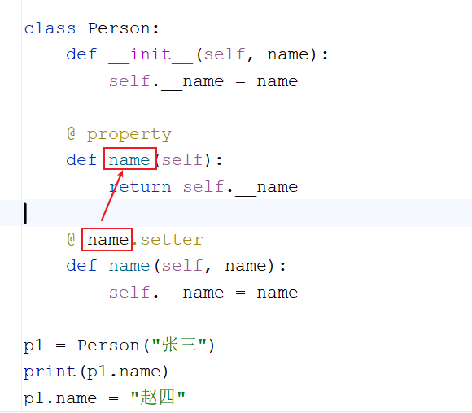
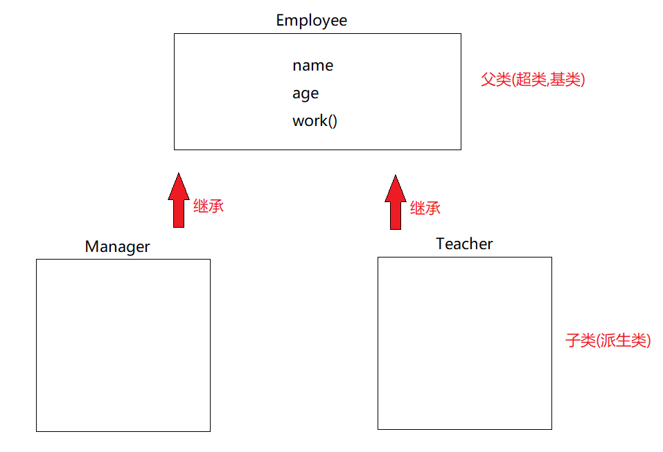
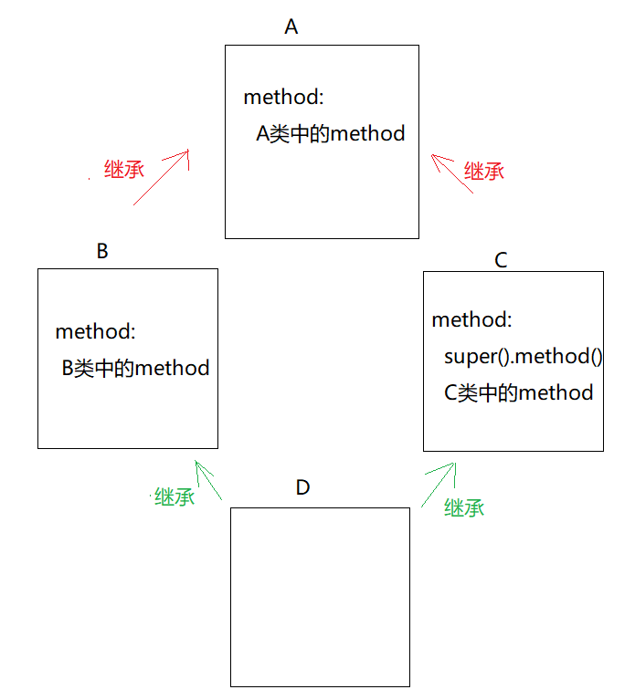
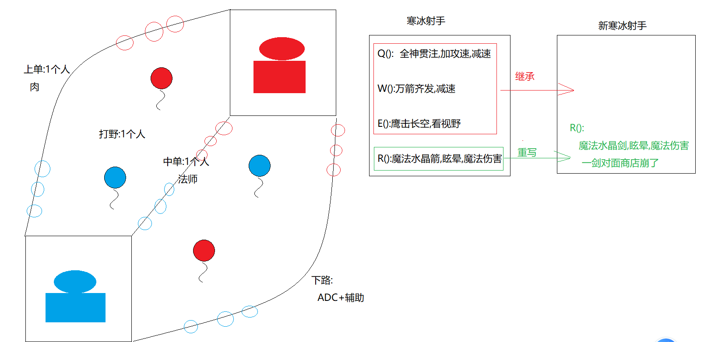

# day08_面向对象三大特征

```java
课前回顾:
  1.打开通道:
    open("文件路径",mode="读写模式",encoding="utf-8")
  2.方法:
    write:写数据
    read:读数据
    readLine():读一行
    close():关闭通道
  3.面向对象:
    a.类:
      class 类名:
         def __init__(self,变量名1,变量名2...):
             self.属性名 = 变量名接收的值
                 
         def 方法名(self):
             方法体
    b.对象:
      对象名 = 类名(实参)
          
  4.__init__方法:
    用于初始化属性使用的,在创建对象之后,会自动调用__init__方法,为属性赋值
  5.self:代表的是当前对象
    哪个对象调用的self所在的方法,self就代表哪个对象
      
      
今日重点:
  1.会定义类中的成员以及调用即可
  2.会封装,继承,多态的使用
```

# 第一章.类中的成员说明

## 1.实例属性

```python
1.概述:实例属性也叫实例变量,所谓的实例就是对象,在类的init方法中定义的属性就是实例属性,通过在init中使用self.属性名定义
2.访问:
  对象名.属性名
3.特点:
  不同的对象为自己的属性赋值,互不影响
```

```python
class Person:
    def __init__(self, name, age):
        """
           self.后面的就是实例属性
           self.属性名  -> 在定义实例属性
        :param name:
        :param age:
        """
        self.name = name
        self.age = age
        
p1 = Person("张三", 18)
print(p1.name, p1.age)
print("======================")
p2 = Person("王五",20)
print(p2.name, p2.age)
```

## 2.类属性

```python
1.概述:也叫做类变量,在类中方法外定义
2.作用:给根据该类创建出来的对象进行数据共享
3.使用:
  a.类名直接调用(推荐)
  b.对象名调用(不推荐)
4.注意:
  a.类属性和实例属性尽量不要重名
    如果重名的话->对象名.变量名 就是实例变量,不是类变量
  b.类属性和实例属性如果重名,调用实例变量就用对象名调用,调用类变量就用类名调用
```

```python
class Person:
    # 类属性
    classroom = "教研室11"

    def __init__(self, name, age):
        self.name = name
        self.age = age

Person.classroom = "教研室12"

p1 = Person("张三", 18)
print(p1.name, p1.age)
print(p1.classroom)
# print(Person.classroom)
print("======================")
p2 = Person("王五",20)
print(p2.name, p2.age)
print(p2.classroom)
# print(Person.classroom)
```

## 3.实例方法

```python
1.概述:在类中定义的方法,一个参数为self,代表当前对象
2.作用:代表的是为此类提供一些行为,功能
3.特点:
  a.实例方法只能被对象调用
  b.可以访问实例属性,类属性,类方法
  c.实例方法的第一个参数是self,用于接收python自动传递过来的对象,self为变量名,可以叫别的,但是尽量不要改名字(习惯,规范)
4.使用:
  对象名去调用
```

```python
class Person:
    def __init__(self, name, age):
        self.name = name
        self.age = age

    #实例方法
    def eat(self):
        print(f"{self.name}正在吃东西...")

p1 = Person("张三", 18)
p1.eat()
```

## 4.类方法

```python
1.概述:在类中定义的方法(定义位置和实例方法一样),通过@classmethod定义,类方法的第一个参数为cls,代表的是这个类本身
2.使用:
  类名直接调用(推荐)
3.使用场景:
  适合一些和类整体相关的操作 -> 比如:可以获取类的一些相关信息
```

```py
class Person:

    """
    这是一个人类
    """
    def __init__(self, name, age):
        self.name = name
        self.age = age
#     类方法
    @classmethod
    def method(cls):
        print(cls.__dict__)#获取类中的具体信息
        print("=====================")
        print(cls.__doc__)#获取类中的说明文档

Person.method()
```

## 5.静态方法

```python
1.概述:也是定义在类中,通过@staticmethod定义
2.使用:
  类名直接调用
3.注意:
  它不访问类或者实例的内部信息,一般都当做工具方法使用,提高代码的复用性
4.使用场景:
  定义工具类使用
5.工具类:
  首先是个类,里面会抽取很多需要反复实现的功能
```

```python
class ArrayUtils:
    @staticmethod
    def sum(*arr):
        sum = 0
        for e in arr:
            sum+=e

        return sum


print(ArrayUtils.sum(1,2,3,4,5))
print(ArrayUtils.sum(11,22,33,44,55))
```

## 6.类方法和静态方法的区别

|                | 类方法 `@classmethod` | 静态方法 `@staticmethod` |
| :------------- | :-------------------- | ------------------------ |
| 第一个参数     | `cls`（类本身）       | 没有 `self` / `cls`      |
| 能访问类属性   | ✅ 能                  | ❌ 不能直接访问           |
| 能访问实例属性 | ❌ 不能                | ❌ 不能                   |
| 本质           | 和“类”绑定的方法      | 只是“放在类里的普通方法” |

## 7.动态添加属性与方法

### 7.1.动态给对象添加属性_添加[实例属性]

```python
直接创建对象,用对象名点想要添加的属性名,然后赋值,这个实例属性只绑定在当前对象上,不会给其他对象共享
```

```py
class Person:
    def __init__(self, name):
        self.name = name

p1 = Person("张三")
print(p1.name)
# print(p1.age)Person中没有定义age属性,所以报错
# 添加age属性
p1.age = 18
print(p1.age)
```

### 7.2.动态给类添加属性_添加[类属性]

```python
直接类名点属性名,这样根据这个类创建出来的对象都能使用这个属性(共享)
```

```python
class Person:
    def __init__(self, name):
        self.name = name

# 给类添加类属性
Person.age = 18

p1 = Person("张三")
print(p1.name,Person.age)
```

### 7.3.动态给类添加类外面的[普通方法]

```python
在类外面定义一个普通的方法,然后将这个方法加到类中
```

```python
class Person:
    def __init__(self, name):
        self.name = name

#定义普通方法
def eat():
    print("吃饭")

#外部的普通方法不会自动接收self参数,需要调用方法的时候手动传入对象
def drink(self):
    print(f"{self.name}正在喝东西...")

p1 = Person("张三")
p1.eat = eat
p1.eat()

print("======================")

p1.drink = drink
p1.drink(p1)
```

### 7.4.动态给类添加[实例方法]

```python
1.概述:将类外面的方法给对象添加成实例方法,这个实例方法只能绑定在当前对象上,不会共享给其他对象
2.使用:
  types.MethodType(方法名,实例对象)
```

```PY
import types


class Person:
    def __init__(self, name):
        self.name = name

def eat(self):
    print(f"{self.name}正在吃东西...")

p1 = Person("张三")
p1.eat = types.MethodType(eat,p1)
p1.eat()
```

### 7.5.动态给类添加[类方法]和[静态方法]

```python
1.概述:将外面的方法给类添加成类中的类方法和静态方法
2.注意:添加的方法对它的所有对象都生效，添加类方法需要传入 cls 参数，添加静态方法则不需要传 cls 参数
```

```py
class Person:
    def __init__(self, name):
        self.name = name

#添加类方法
@classmethod
def class_method(cls):
    print("类方法")

#添加静态方法
@staticmethod
def static_method():
    print("静态方法")

Person.class_method = class_method
Person.static_method = static_method
Person.class_method()
Person.static_method()
```

# 第二章.封装

```java
面向对象三大特征:封装   继承   多态
```

## 1.介绍和基本使用

```python
1.概述:将细节隐藏起来(不让外界直接或者随意使用),同时对外提供一套公共的接口(让调用者通过这个公共的接口间接使用封装起来的细节)
2.表现形式:
  a.将代码放到一个方法中
  b.将代码放到一个类中
  c.将方法和属性前面加上__,代表的是这个成员被私有化了(被私有化的成员只能在当前类中使用,出了这个类不能直接使用了)
3.使用场景:
  a.不让外界直接调用
  b.类中的成员不想被继承
```

```py
class Person:
    def __init__(self, name, age):
        self.name = name
        self.__age = age

    #私有化方法
    def __eat(self):
        print(f"{self.name}正在吃东西...")

    def drink(self):
        self.__eat()
        print(f"{self.name}正在喝东西...")

p1 = Person("张三", -18)
# print(p1.name, p1.age)  age被私有化了,外界不能直接调用
# p1.eat()  eat被私有化了,外界不能直接调用
p1.drink()
```

## 2.为私有属性提供公共的接口

```python
1.概述:
  为私有属性提供的公共接口
2.作用:
  取值  
  赋值,修改值
3.用到的注解:
  @property:取值
     a.要求:将属性名前的__去掉当成方法名
     b.作用:将方法名变成属性来取值    
    
  @属性名.setter:赋值
     a.要求:将属性名前的__去掉当成方法名
     b.作用:将方法名变成属性来赋值
4.注意:
  先写@property,再写@属性名.setter
  因为需要先用@property将对应的方法名变成属性
  才能使用@属性名.setter,也就是说setter前面的@属性名其实是@property修饰的方法名
```

```python
class Person:
    def __init__(self, name):
        self.__name = name

    @ property
    def name(self):
        return self.__name

    @ name.setter
    def name(self, name):
        self.__name = name

p1 = Person("张三")
print(p1.name)#调用的是@property修饰的方法名
p1.name = "赵四"#调用的是@name.setter修饰的方法名
print(p1.name)
```



> ```python
> 1.问题:
>   如果我们不定义私有属性,那么能用@property和@属性名.setter嘛?
> 
> 2.回答:
>   a.如果只在@property修饰的方法中取值,在@属性名.setter修饰的方法中赋值,就没意义
> 
>   b.但是如果想为属性做一个赋值的限制,就有意义了,我们可以在@property修饰的方法中和在@属性名.setter修饰的方法中做对属性赋值的判断或者对属性值的操作
> ```

## 3.封装的说明

```java
1.注意:其实python中将成员封装之后,并不是外界完全使用不了私有的成员了,其实是有办法的
2.访问私有成员:
  对象._类名__私有成员名
3.原因:
  python底层会将__成员名改成_类名__成员名 -> 类似于java中的反射
```

```py
class Person:
    def __init__(self, name):
        self.__name = name

p1 = Person("张三")
# print(p1.__name)
# print(p1.name)
# 对象._类名__私有成员名
print(p1._Person__name)
```

# 第三章.继承

```python
1.概述:python中代码的一种设计思想
2.作用:
  子类继承父类之后,可以直接使用父类中非私有成员,提高代码的复用性,减少了重复性代码
3.好处:
  继承之后,提高了代码的复用性,同时附带灵活性,因为子类继承父类之后,可以直接使用父类中非私有成员,同时还可以在子类中定义子类特有的成员  
```



## 1.单继承

```py
1.格式:
  class 子类(父类):
```

```python
class Employee:
    def __init__(self, name):
        self.name = name

    def work(self):
        print(f"{self.name}正在工作...")


class Teacher(Employee):
    #定义子类特有功能
    def prepare_lesson(self):
        print(f"{self.name}正在准备课程...")

t1 = Teacher("张三")
print(t1.name)
t1.work()
t1.prepare_lesson()
```

## 2.多继承

```python
1.概述:多继承指的是一个子类可以同时继承多个父类
2.格式:
  class 子类(父类1,父类2):
3.注意:
  在多继承的前提下调用方法,如果多个父类中有一样的方法,那么会从左到右的顺序依次查找调用
  当然,子类中有这个方法,肯定是先调用子类中的
```

```python
class Employee:
    def __init__(self, name):
        self.name = name

    def work(self):
        print(f"{self.name}正在工作...")


class Teacher():
    def __init__(self, name):
        self.name = name

    def prepare_lesson(self):
        print(f"{self.name}正在准备课程...")
    

class AITeacher(Employee, Teacher):
    # 子类特有功能
    def teach_python(self):
        print(f"{self.name}正在教python...")

ai1 = AITeacher("张三")
ai1.teach_python()
ai1.work()
ai1.prepare_lesson()
```

```python
class Employee:
    def __init__(self, name):
        self.name = name

    def work(self):
        print(f"{self.name}正在工作...")


class Teacher():
    def __init__(self, name):
        self.name = name

    def work(self):
        print(f"{self.name}正在讲课...")

class AITeacher(Employee, Teacher):
    # 子类特有功能
    def teach_python(self):
        print(f"{self.name}正在教python...")

    # def work(self):
    #     print(f"{self.name}正在瞎教,胡教,正在台上叭叭...")

ai1 = AITeacher("张三")
ai1.work()

```

## 3.复用父类方法的使用_super()

```python
1.概述:super()是python中的一个内置方法
2.作用:可以调用父类中的成员
3.格式:
  super().父类方法名()
```

```python
class Employee:
    def __init__(self, name):
        self.name = name

    def work(self):
        print(f"{self.name}正在工作...")


class Teacher(Employee):
    #定义子类特有功能
    def prepare_lesson(self):

        #调用父类中的work方法
        super().work()

        print(f"{self.name}正在准备课程...")

t1 = Teacher("张三")
t1.prepare_lesson()
```

## 4.super()调用方法的解析顺序

```java
1.注意:super()其实不代表父类对象
      也不是严格按照直接调用父类中的方法来执行的
      而是按照mro继承链中的顺序调用方法的
    
2.什么是mro继承链:
  说白了就是一个子类的继承顺序(体系)
      
3.查看mro继承链(继承顺序)
  类名.__mro__     
```

```python
class A:
    def __init__(self,name):
        self.name = name

    def method(self):
        print("A类中的method方法")

class B(A):

    def method(self):
        print("B类中的method方法")

class C(A):
    def method(self):
        """
          按常理来说:
            C类的父类是A,但是没有走A中的method,却走的是B的
            所以,super()不是直接找父类,而是按照mro继承链中的
            顺序调用的
        """
        super().method()#走的是B类的,而不是A类的
        print("C类中的method方法")

class D(C,B):
    pass


print(D.__mro__)#获取类D的继承链
d1 = D("张三")
d1.method()

```



## 5.方法的重写

```python
1.概述:在子类中有一个和父类一样的方法
2.使用:创建子类对象,调用重写的方法
```

```python
class Employee:
    def __init__(self, name):
        self.name = name

    def work(self):
        print(f"{self.name}正在工作...")


class Teacher(Employee):
    def work(self):
        print(f"{self.name}正在吹牛x...")

t1 = Teacher("张三")
t1.work()
```

### 5.2.方法重写的使用场景

```java
在子类中对父类中的某个功能进行升级改造
```



```python
class HanBing:
    def __init__(self, name):
        self.name = name

    def q(self):
        print(f"{self.name}正在使用(全神贯注)技能...")

    def w(self):
        print(f"{self.name}正在使用(万箭齐发)技能...")

    def e(self):
        print(f"{self.name}正在使用(鹰击长空)技能...")

    def r(self):
        print(f"{self.name}正在使用(魔法水晶箭)技能...")


class NewHanBing(HanBing):
    def r(self):
        super().r()
        print("一剑摧毁对方商店")


hb1 = NewHanBing("艾希")
hb1.q()
hb1.w()
hb1.e()
hb1.r()
```

> 作业:定义手机类,包含打电话(call),发短信(message)和来电显示(show)功能
>
> ​         后来新手机针对来电显示(show)进行了升级,可以显示头像了
>
> ​         用代码实现这个需求
>
> ```python
> 
>    ```

