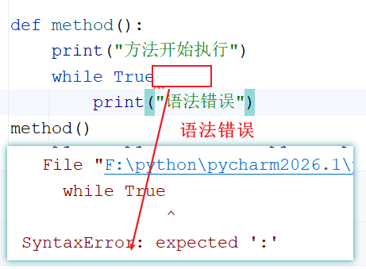
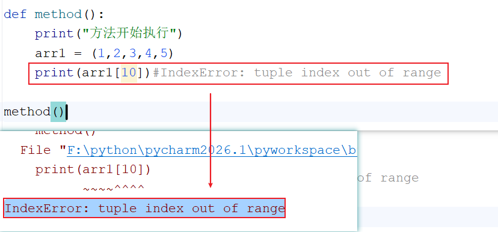
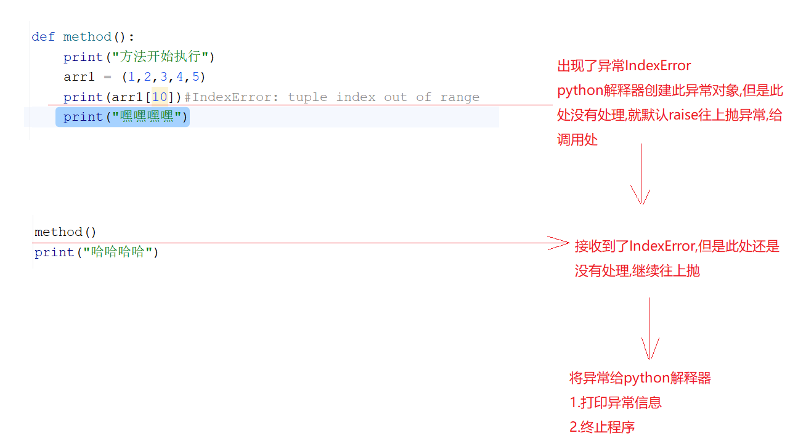
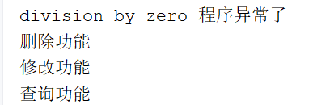
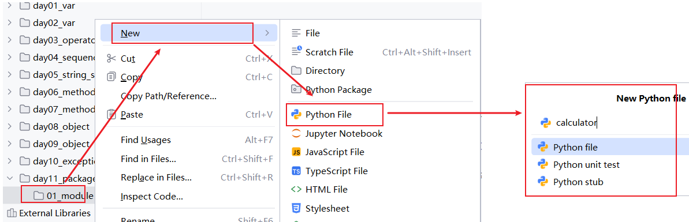
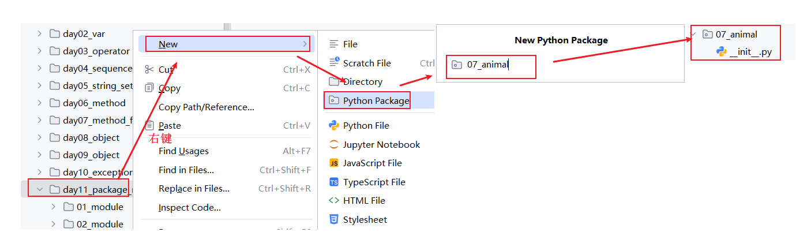
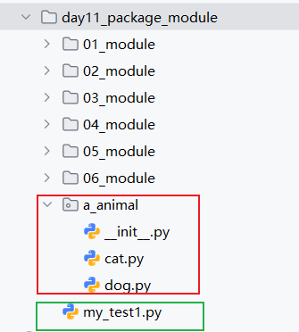

# day09_错误&异常&包

```python
课前回顾:
  1.类中的成员:
    a.实例属性:self.属性名   -> 对象调用
    b.类属性:定义在类中方法外  -> 类名调用
    c.实例方法:在类中    -> 对象调用
    d.类方法:  -> 类名调用  -> @classmethod
    e.静态方法:  -> 类名调用 -> @staticmethod
  2.封装:将细节隐藏起来,对外提供一套公共的接口(通过公共的接口间接使用封装起来的细节)
    a.体现:
      将代码放到一个代码块中(方法,类中)
      私有化:在属性和方法前加上__
    b.公共的接口:
      @Property   -> 取值 
      @属性名.setter -> 赋值   -> 属性名用的是@Property修饰的那个方法名
  3.继承:
    a.格式:  子类(父类1,父类2)
    b.重写:  子类中有一个和父类一样的方法
      使用场景:对父类中的某个方法进行升级改造
    c.super()   -> 调用父类中的成员
      super()调用的时候按照mro继承链去调用的   __mro__
今日重点:
   1.会使用多态
   2.会异常处理
   3.会导入模块和导包
```

# 第一章.多态

## 1.基本使用

```python
1.概述:一个对象有不同的形态
2.常见的多态前提:
  a.继承
  b.方法的重写
  c.父类引用指向子类对象
3.好处:
  一个变量可以动态接收不同的对象,接收哪个对象就用那个对象的方法

4.注意:python中的多态主要还是强调不同类中有相同的方法
```

```python
class Animal:
    def eat(self):
        print("吃吃吃")

class Dog(Animal):
    def eat(self):
        print("🐶喜欢吃💩")

class Cat(Animal):
    def eat(self):
        print("🐱喜欢吃🐟")

# 定义一个方法,这个方法统一调用传递过来不同对象的eat
def method(animal):
    animal.eat()

dog = Dog()
method(dog)
cat = Cat()
method(cat)
```

> 其实在python中的多态不强调是否真的继承了,在不同的类中只要有相同的方法,就可以完成python中多态的写法

## 2.多态的弊端_扩展

```java
弊端:如果子类中有特有方法,调用的时候可能会出现一些问题
```

```python
class Animal:
    def eat(self):
        print("吃吃吃")

class Dog(Animal):
    def eat(self):
        print("狗吃屎")

    #特有方法
    def look_home(self):
        print("狗会看家")

class Cat(Animal):
    def eat(self):
        print("猫吃鱼")

    #特有方法
    def catch_mouse(self):
        print("猫会抓老鼠")

# 定义一个方法,这个方法统一调用传递过来不同对象的eat
def method(animal):
    animal.eat()
    #如果animal接收的是cat,cat中没有定义look_home方法,就会报错
    animal.look_home()
    #如果animal接收的是dog,dog中没有定义catch_mouse方法,就会报错
    animal.catch_mouse()

dog = Dog()
method(dog)
cat = Cat()
method(cat)
```

## 3.判断对象类型_扩展

```java
1.如何判断对象的类型
  isinstance(变量名,类型)   -> 判断这个变量是否属于指定的类型
```

```python
class Animal:
    def eat(self):
        print("吃吃吃")

class Dog(Animal):
    def eat(self):
        print("狗吃屎")

    #特有方法
    def look_home(self):
        print("狗会看家")

class Cat(Animal):
    def eat(self):
        print("猫吃鱼")

    #特有方法
    def catch_mouse(self):
        print("猫会抓老鼠")

# 定义一个方法,这个方法统一调用传递过来不同对象的eat
def method(animal):
    animal.eat()
    #如果animal接收的是cat,cat中没有定义look_home方法,就会报错
    #animal.look_home()
    #如果animal接收的是dog,dog中没有定义catch_mouse方法,就会报错
    #animal.catch_mouse()
    if isinstance(animal,Dog):
        animal.look_home()
    elif isinstance(animal,Cat):
        animal.catch_mouse()
    else:
        print("不许瞎传")

dog = Dog()
method(dog)
cat = Cat()
method(cat)
```

## 4.鸭子类型_扩展

```java
1.概述:python在多态中的一种设计思想
2.特点
  a.不需要继承
  b.不同类中拥有同名的方法 -> 只要有相同方法，就能当同一类来用
3.好处:
  一个变量可以动态接收不同的对象,接收哪个对象就用那个对象的方法
```

```python
class Animal:
    def eat(self,obj):
        obj.eat()

class Dog:
    def eat(self):
        print("狗吃屎")


class Cat:
    def eat(self):
        print("猫吃鱼")

animal = Animal()
animal.eat(Dog())
animal.eat(Cat())
```

# 第二章.异常的介绍

```python
1.说明:python是一门解释型语言,只有在程序运行的时候才会进行语法检查,所以,只有在运行代码的时候才能真正知道程序能不能正常运行
2.分类:
  a.语法错误
  b.异常:
    普通异常常用父类 : Exception
```

## 1.语法错误

```python
程序在解析代码的时候遇到的错误
```

```py
def method():
    print("方法开始执行")
    while True
        print("语法错误")
method()
```



```java
上面的代码出现了语法错误,python在运行的时候先要保证语法没有问题,现在语法有问题了,所以语法错误上面的代码都不会执行
```

> 语法错误,不需要异常处理,因为语法错误不属于异常,直接改代码即可

## 2.异常

```python
1.概述:程序的语法没有问题,但是在运行的时候,就会出现问题,这种叫做异常
2.异常的出现过程:
  从出现异常的这一行开始,python解释器判断此处的异常有没有处理,如果没有处理,会自动调用raise将异常抛给调用处,再看调用处有没有处理异常,如果还没处理,最终会用raise将异常抛给python解释器,python解释器先将异常打印到控制台上,然后终止程序
```

```python
def method():
    print("方法开始执行")
    arr1 = (1,2,3,4,5)
    print(arr1[10])#IndexError: tuple index out of range
    print("嘿嘿嘿嘿")

method()
print("哈哈哈哈")
```





> 异常需要处理

# 第三章.异常处理

```python
1.注意:异常处理不是说将异常规避了,而是在程序运行的过程中,出现异常的时候给一个解决方案,异常处理之后,下面的代码不影响执行
```

## 1.try...except

```py
1.语法:
  try:
    可能出现异常的代码
  except 异常类型 as 变量名: 
    异常处理的代码  -> 一般情况下直接输出异常信息,开发中一般会将异常信息保存到日志文件中
    
2.执行流程:    
  a.如果try中的代码没有发生异常,程序不走 except ,下面的代码会继续往下走
  b.如果try中的代码发生了异常,会直接执行except进行捕获,捕获到了就执行except里面的代码,如果没有捕获到,相当于没有处理
    
3.注意:
  a.except必须要捕获到异常,如果捕获不到,证明没处理,那么异常就会自动往外抛出最终给python解释器,python解释器直接将异常信息打印到控制台上并结束程序,后面的代码也就不会走了

  b.except后面不写具体异常类型,就证明啥异常都能捕获
    
4.快速处理异常快捷键:
  a.选中要处理的代码
  b.ctrl+alt+t
```

```python
def add():
    print(1/0)
    print("添加功能")

try:
    add()
except Exception as e:
    print(e,"程序异常了")

print("删除功能")
print("修改功能")
print("查询功能")
```




## 2.处理不同类型的异常

```python
1.格式:
  try:
    可能出现异常的代码
  except 异常类型 as 变量名: 
    异常处理的代码
  except 异常类型 as 变量名: 
    异常处理的代码
  except 异常类型 as 变量名: 
    异常处理的代码
  except (异常类型,异常类型,异常类型)as 变量名: 
    异常处理的代码  
2.执行特点:
  哪个except捕获到异常了,就走哪个except
```

```python
try:
    tuple1 = (1, 2, 3)
    print(tuple1[5])
    print(1 / 0)
    print("修改功能")
except ZeroDivisionError as e:
    print(e, "0不能做除数")
except IndexError as e:
    print(e, "索引越界")
except (TypeError, NameError) as e:
    print(e, "类型错误或者未定义")
except:
    print("Unexpected error")
```

> 注意:
>
> 如果用except捕获异常,但是没有捕获到,相当于没有捕获,那么try...except后面的代码是不会走的
>
> ```python
> try:
> result = 3 / 0
> # print(result1)
> except NameError as e:
> print(e)
> print("我要执行了")
> ```

## 3.else关键字_了解中的了解

```py
1.概述:将else放到所有except后面
2.格式:
  try:
    可能发生异常的代码
  except 异常类型1 as 变量名1:
    异常处理的代码
  except 异常类型2 as 变量名2:
    异常处理的代码
  except(异常类型3) as 变量名3:
    异常处理的代码
  except:
    异常处理的代码
  else:
    没有异常时执行的代码
3.注意:
  else中的代码其实跟放到try里面效果是一样的,都是try里面的代码有异常了就不走try下面的代码了;没有出异常才会走
  仅仅是为了结构清晰一点,走了else中的代码能够清晰的说明没有异常发生
```

```python
try:
 # result = 3 / 1
 result = 3 / 0
 # print("没有异常执行的代码")
except ZeroDivisionError as e:
 print(e)
else:
 print("没有异常执行的代码...")
```

## 4.finally关键字

```python
1.格式:
  try:
    可能出现的异常代码
  except 异常 as 变量名:
    异常处理的代码
  finally:
    不管有没有异常,不管是否捕获到了异常,都一会定执行的代码
2.含义:
  不管有没有异常,不管是否捕获到了异常,都一会定执行的代码
3.finally的意义:
  关闭资源,释放资源
```

```python
try:
 result = 3 / 0
 print(result)
 # print("没有异常执行的代码")
except ZeroDivisionError as e:
 print(e)
finally:
 print("不管是会否有异常或者是否能捕获到异常,我必须走")
```

## 5.raise抛出异常

```python
1.问题描述:当我们调用别人提供给咱们的方法时,人家在底层实现的时候,有可能会判断,如果出现什么情况,就会抛出什么异常,此时这个异常就会抛给我们调用者,然后我们自己try处理一下

2.格式: 抛出异常
  raise 异常(异常信息)
```

```python
def int_add(x, y):
    if isinstance(x, int) and isinstance(y, int):
        return x + y
    else:
        # 抛出异常
        raise TypeError("参数类型错误")


try:
    result = int_add(1, "2")
    print(result)
except:
    print("程序异常了")
```

## 6.assert断言_了解

```py
1.作用:
  用于判断一个条件表达式,如果这个条件表达式的结果为false,触发异常
2.格式:
  assert 条件表达式,异常信息

  等价于:
  if not 条件表达式:
    raise 异常(异常信息)
    
3.使用场景:
  一般用于调试程序,调试之后需要将assert干掉 -> 了解
```

```python
def int_add(x, y):
    assert isinstance(x, int) and isinstance(y, int),"参数类型错误"
    return x + y

try:
    result = int_add(1, 2)
    print(result)
except:
    print("程序异常了")
```

# 第四章.自定义异常

```python
1.问题描述:
  将来如果我们抛出的异常不是python自带的,这个时候就需要我们自己自定义异常
2.格式:
  class 自定义类名(Exception):
```

```py
"""
  自定义异常类
"""
class MyTypeError(Exception):
    def __init__(self, message):
        self.message = message

def int_add(x, y):
    if isinstance(x, int) and isinstance(y, int):
        return x + y
    else:
        # 抛出异常
        raise MyTypeError("自定义异常-参数类型错误")


try:
    result = int_add(1, "2")
    print(result)
except MyTypeError as e:
    print(e)
```

# 第五章.异常的传递

```python
1.问题描述:
  当存在 try 嵌套或函数嵌套时，若内层出现了异常且在内层无法处理，会将异常一层一层向外传递，直到异常被处理或程序报错
```

```py
try:
 try:
  try:
   print(1 / 0)
  except NameError as e:
   print("第三层", e)
 except TypeError as e:
  print("第二层", e)
except Exception as e:
 print("第一层",  e)
```

# 第六章.with关键字

```py
1.问题描述:
  如果要是写文件流对文件进行读写的代码,用try except finally做异常处理,会比较麻烦
2.解决:
  Python中的with语句用于异常处理，但是它简化了try except finally的异常处理操作,让异常处理的代码更加清晰明了
3.格式:
  with 表达式 as 对象名:
    代码
```

```py
try:
 file1 = open("1.txt","wt",encoding="utf-8")
 file1.write("helloworld")
 # file1.close()
except Exception as e:
    print(e)
finally:
 #判断文件对象是否关闭
 print(file1.closed)
```

```py
try:
 with open("1.txt","wt",encoding="utf-8") as file1:
  file1.write("helloworld11")
except Exception as e:
    print(e)
finally:
 #判断文件对象是否关闭
 print(file1.closed) #True
```

```python
使用with表达式简化了文件操作的异常处理:
==========================================
try:
 with open("1.txt","wt",encoding="utf-8") as file1:
  file1.write("helloworld11")
except Exception as e:
    print(e)
```

# 第七章.常见的异常

## 1.异常父类

| 异常            | 说明                                                         |
| --------------- | ------------------------------------------------------------ |
| BaseException   | 所有内置异常的基类。它不应该被用户自定义类直接继承（这种情况请使用[Exception](#Exception)）。 |
| Exception       | 所有内置的非系统退出类异常都派生自此类。所有用户自定义异常也应当派生自此类。 |
| ArithmeticError | 此基类用于派生针对各种算术类错误而引发的内置异常：[OverflowError](#OverflowError), [ZeroDivisionError](#ZeroDivisionError), [FloatingPointError](#FloatingPointError)。 |
| BufferError     | 当与[缓冲区](#bufferobjects)相关的操作无法执行时将被引发。   |
| LookupError     | 此基类用于派生当映射或序列所使用的键或索引无效时引发的异常：[IndexError](#IndexError), [KeyError](#KeyError)。这可以通过 [codecs.lookup()](#codecs.lookup) 来直接引发。 |

## 2.常见子类异常

| 异常              | 说明                                                         |
| ----------------- | ------------------------------------------------------------ |
| AssertionError    | 当 [assert](#assert) 语句失败时将被引发。                    |
| AttributeError    | 当属性引用或赋值失败时将被引发。                             |
| IndexError        | 当序列抽取超出范围时将被引发。                               |
| KeyError          | 当在现有键集合中找不到指定的映射（字典）键时将被引发。       |
| KeyboardInterrupt | 当用户按下中断键 (通常为 Control-C 或 Delete) 时将被引发。   |
| MemoryError       | 当一个操作耗尽内存但情况仍可（通过删除一些对象）进行挽救时将被引发。 |
| NameError         | 当某个局部或全局名称未找到时将被引发。                       |
| OSError           | 此异常在一个系统函数返回系统相关的错误时将被引发，此类错误包括 I/O 操作失败例如 文件未找到 或 磁盘已满 等。 |
| SyntaxError       | 当解析器遇到语法错误时引发。                                 |
| TypeError         | 当一个操作或函数被应用于类型不适当的对象时将被引发。         |

# 第八章.模块

## 1.模块介绍

```python
1.概述:python中以.py结尾的源文件就是一个模块,其中包含了python的代码
      我们将实现某个特定功能的代码放到一个.py文件中作为一个模块
2.作用:
  a.将实现功能的代码放到模块中起到了封装的作用,提高代码的可维护性,复用性
  b.通过模块把同名的变量名分开,解决成员命名的冲突问题
```

## 2.创建模块

```python
1.概述:说白了就是创建一个.py文件,但是命名不要和py自带模块名冲突
```



## 3.模块的导入

### 3.1.全局导入

```python
1.导入位置:所有类之外
2.格式:
  import 模块名 [as 别名]  -> as 别名可写可不写
3.如何调用模块中的成员:
  a.没有取别名: 模块名.成员名
  b.取了别名: 别名.成员名 -> 此时就不能用模块名调用了,只能用别名
```

```python
需求:在同一个目录下创建一个main.py文件,在其中导入my_add.py模块中的添加函数并使用
```

```python
my_add.py
==================================
def add(x,y):
    return x+y
```

```python
main.py
==================================
# import my_add
import my_add as myadd
# print(my_add.add(1, 2))
print(myadd.add(1, 2))
```

### 3.2.局部导入

#### 3.2.1.情况1

```python
1.使用场景:如果我们不想将模块中所有的成员都导入进来,想导入指定的成员,就可以使用局部导入
2.格式:
  a.from 模块名 import 成员名1,成员名2...
  b.from 模块名 import 成员名1 as 别名1,成员名2 as 别名2...
3.使用:
  a.如果不取别名:直接通过成员名调用访问
  b.如果取了别名:直接写成员名即可
4.注意:
  如果多个模块中存在重名的成员,后一次导入的会覆盖前一次导入的
```

```python
需求:在同一个目录下创建一个main.py文件,在其中导入my_calculator.py模块中的函数并使用
```

```python
my_calculator.py
===================================
def add(x,y):
    return x+y

def sub(x,y):
    return x-y

def mul(x,y):
    return x*y

def div(x,y):
    return x/y
```

```py
my_add.py
==================================
def add(x,y):
    return x+y
```

```python
main.py
====================================
# from my_calculator import add,sub
# print(add(1,2))
# print(sub(1,2))

from my_calculator import add as a,sub as s
from my_add import add as a1
print(a(1,2))
print(s(1,2))
print(a1(1,20))
```

#### 3.2.2.情况2

```python
1.格式:from 模块名 import *
2.注意:
  导入模块中所有不以一个_开头的成员,直接通过成员名访问
```

```py
my_calculator.py
===================================
def add(x,y):
    return x+y

def sub(x,y):
    return x-y

def _mul(x,y):
    return x*y

def div(x,y):
    return x/y
```

```python
main.py
====================================
from my_calculator import *
print(add(1,2))
print(sub(1,2))
# print(_mul(1,2))
print(div(1,2))
```

### 3.3. \__all__

```py
1.作用:
  使用from import *导入模块时，可以在被导入的模块中使用 __all__设置哪些内容可以被导入
2.注意:__all__ 的设置只针对使用 from import * 导入模块时有效
```

```python
my_import.py
====================================
# 规定外界只能调用哪些成员
__all__ = ["add","str1"]
str1 = "hello"
def add(x,y):
    return x+y
def sub(x,y):
    return x-y
```

```python
my_main.py
====================================
from my_import import *
print(add(1,2))
# print(sub(1,2))
print(str1)
```

### 3.4.\__name__

```python
1.问题描述:
  当我们在my_add.py中定义了add的函数,然后在[本模块中打印调用],那么在main.py模块中直接导入模块之后发现my_add中的所有代码就能直接执行
  但是我们不想导入这个模块之后执行这个[打印调用]代码,怎么办呢
2.问题解决: 
  a.python中有一个内置变量: __name__  -> 当直接执行这个Python文件时，该文件的__name__属性值为"__main__",在别的模块中导入__name__所在的模块之后执行,就不是__main__了,__name__代表的就是__name__所在的模块名了

  b.我们在被导入的模块中做一个判断: 这样,在导入别的模块的模块中直接执行,就不会执行我们if里面的代码了
    if __name__ == "__main__":
        要执行的代码
```

```py
def add(x,y):
    return x+y

# print(__name__)#直接执行此模块,会打印__main__
if __name__ == "__main__":
 print(add(1,2))
```

```py
# from my_add import add
# import my_add
from my_add import *
# 在这里直接运行__name__输出的是被导入模块的模块名
```

> ```py
> 使用场景:如果模块A会被其他模块导入使用,但是模块A中有一些"测试代码",不想让别的模块导入模块A的时候执行这些"测试代码",那么就可以将这些测试代码放到if __name__ == "__main__"的判断中
> ```

# 第九章.包

```python
1.概述:
  包是管理python模块的位置,但是这里的包不是我们自己创建的文件夹
2.包和普通的文件夹的一个小区别:
  包下面有一个__init__.py的python文件
3.作用:
  可以将实现相同业务的多个模块分类管理,代码结构清晰明了,好维护
```

```py
假设要为统一处理声音文件与声音数据设计一个模块集（包）。声音文件的格式很多（通常以扩展名来识别，例如：.wav，.aiff,.au），因此，为了不同文件格式之间的转换，需要创建和维护一个不断增长的模块集合。为了实现对声音数据的不同处理（例如：混声、添加回声、均衡器功能、创造人工立体声效果），还要编写无穷无尽的模块流。下面这个分级文件树展示了这个包的架构：

sound/                          最高层级的包
      __init__.py               初始化 sound 包
      formats/                  用于文件格式转换的子包
              __init__.py
              wavread.py
              wavwrite.py
              aiffread.py
              aiffwrite.py
              auread.py
              auwrite.py
              ...
      effects/                  用于音效的子包
              __init__.py
              echo.py
              surround.py
              reverse.py
              ...
      filters/                  用于过滤器的子包
              __init__.py
              equalizer.py
              vocoder.py
              karaoke.py
              ...
```

## 1.创建包

```
右键 -> new -> package -> 取包名
```



## 2.导入包



```python
dog.py
==================================
def eat(str):
    print(f"狗在啃{str}")
```

```python
cat.py
==================================
def eat(str):
    print(f"猫在吃{str}")
```

### 2.1.全局导入_import

```python
1.语法:
  a.import 包名.模块名
  b.import 包名.模块名 as 别名
2.调用方式:
  a.没有取别名:包名.模块名.成员名
  b.取了别名:别名.成员名
3.注意:  
  不要具体到成员名
```

```py
# import a_animal.dog
# import a_animal.cat
# a_animal.dog.eat("骨头")
import a_animal.dog as d
d.eat("骨头")
```

### 2.2.局部导入_from import

#### 2.2.1.局部导入包下的模块

```python
1.语法:
  a.from 包名 import 模块名
  b.from 包名 import 模块名 as 别名
2.调用:
  a.没有取别名: 模块名.成员名
  b.取别名:别名.成员名
```

```python
# 局部导入  从包中导入模块
# from a_animal import dog
# dog.eat("骨头")
from a_animal import dog as d
d.eat("骨头")
```

#### 2.2.2.局部导入包下模块的成员

```py
1.语法:
  a.from 包名.模块名 import 成员名
  b.from 包名.模块名 import 成员名 as 别名
2.调用:
  a.没有取别名: 直接写成员名
  b.取别名: 直接写别名即可
```

```python
# 局部导入  从包中导入模块中的成员
# from a_animal.dog import eat
# eat("骨头")
from a_animal.dog import eat as e
e("骨头")
```

> 快速将一段代码抽取到方法中:
>
> 1.选中这段代码
>
> 2.按:ctrl+alt+m
