# day10_python高级语法

```java
课前回顾:
  1.多态:在python中只要不同类中有相同的方法,就可以写成多态
  2.异常:
    a.处理异常:
      try:
        可能出现异常的代码
      except 异常类型 as 变量名:
        异常处理方案
    
    b.处理之后:如果某个功能出现问题,不会影响其他功能的执行
  3.finally:配合try...except使用
    不管是否有异常,或者不管是否能捕获异常,都一定会执行的代码块
    
    手动关闭资源使用
      
  4.with关键字:
    自动关闭资源
        
  5.raise关键字:抛出异常,往上抛
      
  6.自定义异常:
    这个异常类要继承Exception
        
        
  7.__name__:
    a.如果直接指定本类中的代码,__name__就是__main__,如果在其他模块中执行__name__所在的模块的代码,__name__代表所在的模块名
        
        
今日重点:
  1.会安装第三方库
  2.会使用迭代器遍历容器
  3.会使用生成器
  4.能理解闭包操作即可    
```

# 第一章.安装第三方库

## 1.标准库介绍

```python
1.标准库概念:安装python环境的时候就被安装的库,说白了就是python提前给咱们准备好的库,可以直接拿过来用
```

| 名称            | 说明                                                         |
| --------------- | ------------------------------------------------------------ |
| os              | 多种操作系统接口。                                           |
| sys             | 系统相关的形参和函数。                                       |
| time            | 时间的访问和转换。                                           |
| datetime        | 提供了用于操作日期和时间的类。                               |
| math            | 数学函数。                                                   |
| random          | 生成伪随机数。                                               |
| re              | 正则表达式匹配操作。                                         |
| json            | JSON 编码器和解码器。                                        |
| collections     | 实现了一些专门化的容器，提供了对 Python 的通用内建容器 dict、list、set 和 tuple 的补充。 |
| functools       | 高阶函数，以及可调用对象上的操作                             |
| hashlib         | 安全哈希与消息摘要。                                         |
| urllib          | URL 处理模块。                                               |
| smtplib         | SMTP 协议客户端，邮件处理。                                  |
| zlib            | 与 gzip 兼容的压缩。                                         |
| gzip            | 对 gzip 文件的支持。                                         |
| bz2             | 对 bzip2 压缩算法的支持。                                    |
| multiprocessing | 基于进程的并行。                                             |
| threading       | 基于线程的并行。                                             |
| copy            | 浅层及深层拷贝操作。                                         |
| socket          | 低层级的网络接口。                                           |
| shutil          | 提供了一系列对文件和文件集合的高阶操作，特别是提供了一些支持文件拷贝和删除的函数。 |
| glob            | Unix 风格的路径名模式扩展。                                  |

> 更多标准库可参考https://docs.python.org/zh-cn/3/library/index.html。

## 2.引入第三方库

```python
1.概述:python没有内置的库,就是第三方库
2.注意:第三方库需要下载,那么下载就需要一个包管理工具,就是pip
```

### 2.1.pip命令方式引入第三方库

```python
1.概述:pip是Python包管理工具，该工具提供了对 Python 包的查找、下载、安装、卸载的功能。pip 默认的源是 Python Package Index（PyPI），其地址为 https://pypi.org/simple/，如果下载比较慢，还可以指定其它的源:
    
 a.阿里云：https://mirrors.aliyun.com/pypi/simple/
 b.豆瓣：https://pypi.douban.com/simple/
 c.清华大学：https://pypi.tuna.tsinghua.edu.cn/simple/
```

#### 2.1.1.pip常用命令

```python
1.查看已经安装的软件包
  pip list
```


```py
2.安装软件包->具体包名是什么可以到PyPI上找  -> 要是安装中央仓库的源会比较慢
  pip install 包名
```

```python
3.卸载软件包
  pip uninstall 包名
```

```py
4.临时使用其他源
  pip install -i https://mirrors.aliyun.com/pypi/simple/ 包名
```

```python
5.永久修改源
  pip config set global.index-url https://mirrors.aliyun.com/pypi/simple/
```

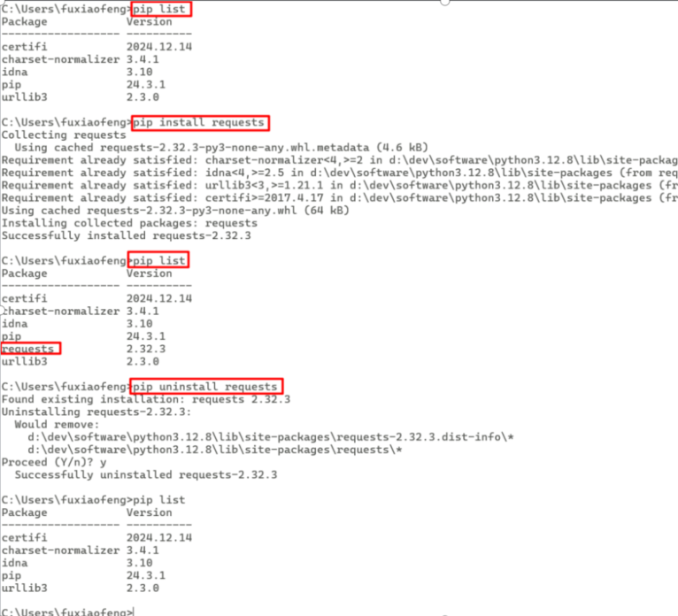

> 命令的方式会将第三方库自动放到:F:\python\python-3.12.8\Lib\site-packages下面

### 2.2.使用pycharm中引入第三方库

```python
1.注意:我们直接在dos命令窗口中使用pip安装的库属于python的基础环境,不属于当前项目的.venv虚拟环境
2.我们还可以在当前项目的虚拟环境下安装第三方库
  打开pycharm,在pycharm中的终端输入:pip list
  发现在全局环境中安装的库在当前项目的虚拟环境下没有,所以说明全局环境和当前项目的虚拟环境是两套环境
3.在全局环境下安装的库在python解释器安装路径下的Lib\site-packages\
```

#### 2.2.1.在pycharm终端安装和卸载库

```cmd
安装库
===========================================================================
(.venv) PS F:\python\pycharm2026.1\pyworkspace\mybase> pip install requests 
```

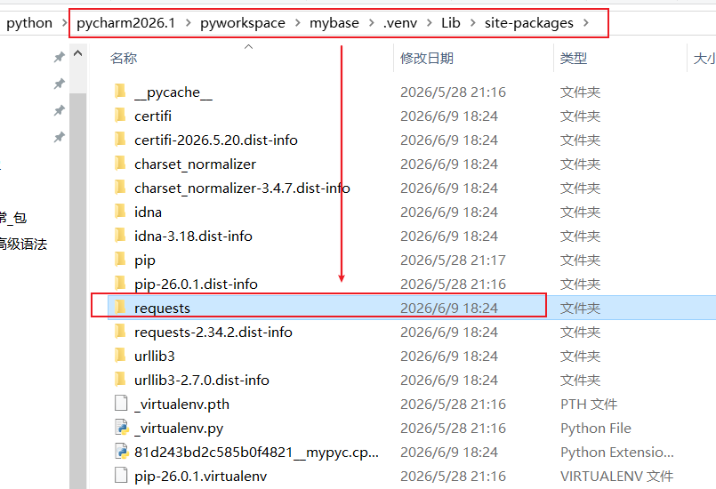

```cmd
卸载库:
===========================================================================
(.venv) PS F:\python\pycharm2026.1\pyworkspace\mybase> pip uninstall requests
```

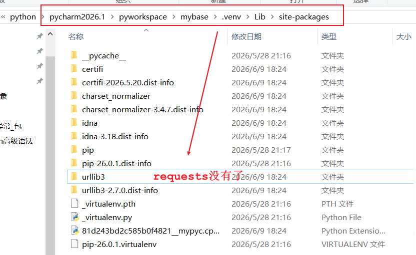

```java
1.问题说明:我们在dos命令窗口中能不能操作项目中的.venv虚拟环境呢?
          可以,只需要在dos命令窗口中激活项目的虚拟环境即可
2.激活当前虚拟环境命令位置,如下图
```

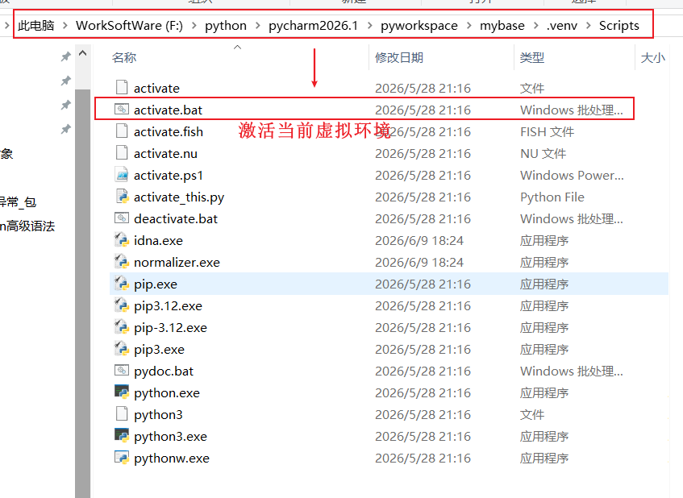

```java
进入对应的位置,输入 activate 命令进行激活:
F:\python\pycharm2026.1\pyworkspace\mybase\.venv\Scripts>activate
  
    
(.venv) F:\python\pycharm2026.1\pyworkspace\mybase\.venv\Scripts>    
```

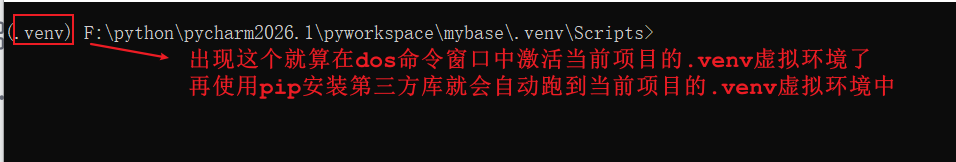

#### 2.2.2.在pycharm中通过点击的方式安装和卸载第三方库(了解)

```python
点击+号
```

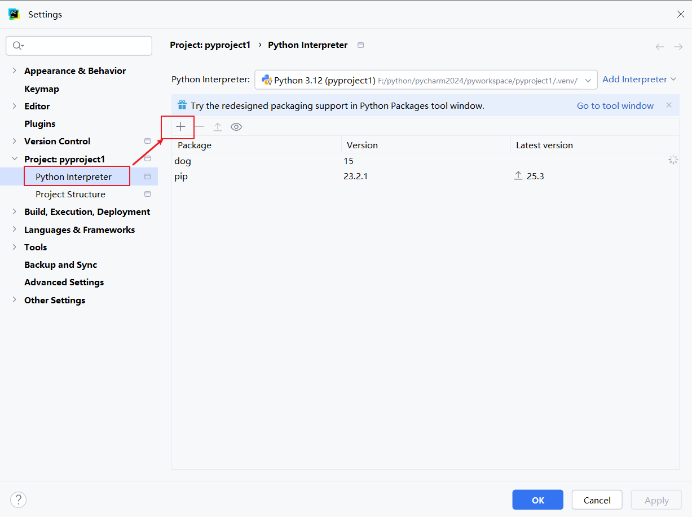

```python
3.搜索要添加的包
```

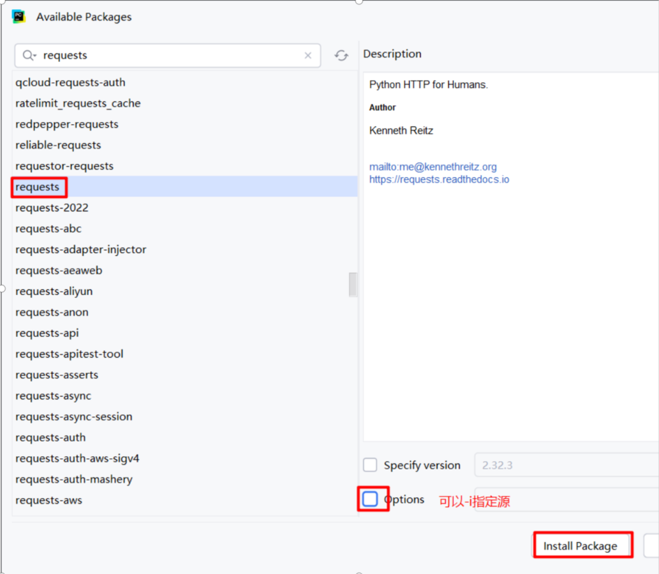

### 2.3.打包自己写的库并安装

```python
1.问题描述:
  假如我开发好了几个模块,但是你们需要我开发好的模块的功能,怎么办?我就需要将我开发好的模块打包成库给你们
  然后你们在本机上安装我打包好的包即可
2.先安装setuptools库
  ->如果不安装setuptools库，后续打包时可能会遇到报错 ModuleNotFoundError: No module named 'distutils'，所以可以提前安装 setuptools 库
    
  pip install setuptools  
```

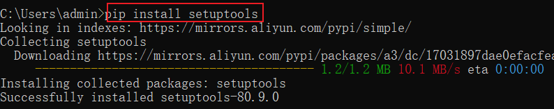

```python
2.在包外创建一个setup.py文件
```

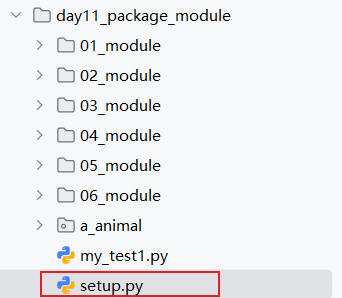

```python
3.在setup.py中添加以下代码
==========================================
from distutils.core import setup
setup(
    name="模块所在包名", # 需要打包的名字
    version="1.0", # 版本
    py_modules=["模块所在包名.circle", "模块所在包名.rectangle"], # 需要打包的模块
)
```

> 以上代码需要在pycharm中安装 setuptools 库才能使用,然后build构建

```python
4.在cmd中打包 -> 在setup.py同级目录下进行构建
  a.进入到setup.py文件所在的本地目录
  b.然后构建
    python setup.py build 
```

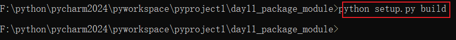

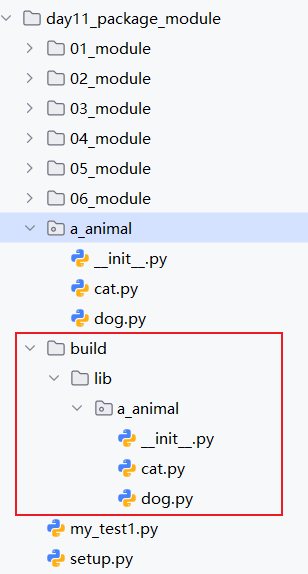

```python
5.还可以将其压缩,变成压缩包给别人:
  python setup.py sdist
```


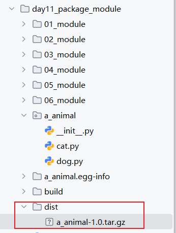

```python
6.给别人,让别人安装我们自己提供的库
  pip install F:\python\pycharm2024\pyworkspace\pyproject1\day11_package_module\dist\a_animal-1.0.tar.gz
```

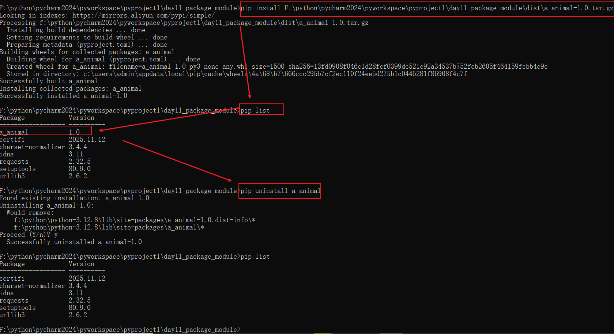

### 2.4.pycharm中安装自己打包的库

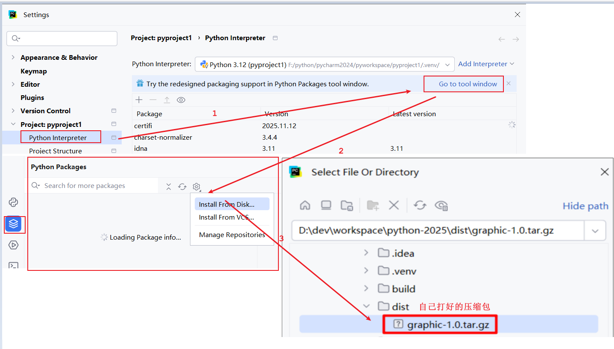

```py
测试:
   在pycharm中导包使用
=====================================   
   from 包名 import 模块名
   调成员
```

```py
from a_animal import dog
dog.eat("骨头")
```

# 第二章.迭代器

## 1.迭代器介绍和基本使用

```python
1.概述:其实就是一个对象  -> Iterator
      凡是可以使用for循环遍历的容器都是可迭代的对象,所以就都可以使用迭代器去遍历操作
      包括:list,tuple,dict,set,str,文件,generator
2.主要作用:
  遍历容器
3.使用:
  a.方法1:iter(容器名)  -> 创建一个迭代器对象
    底层会自动调用__iter__()魔法方法,获取当前对象的迭代器对象
  b.方法2:next()  -> 获取下一个元素
    底层会自动调用__next__()魔法方法,来获取下一个元素
```

```python
list1 = ["张三","李四","王五","赵六"]
# iter1 = iter(list1)
# print(next(iter1))
# print(next(iter1))
# print(next(iter1))
# print(next(iter1))
# print(next(iter1))StopIteration
for i in list1:
    print(i)
print("========================")
list2 = [1,2,3,4,5]
iter2 = iter(list2)
for e in iter2:
    print(e)
```

> 使用迭代器去遍历容器的时候,起始位置是在第一个元素的前面,然后依次调用next()获取下一个元素,当获取完毕再获取就会出现异常
>
> 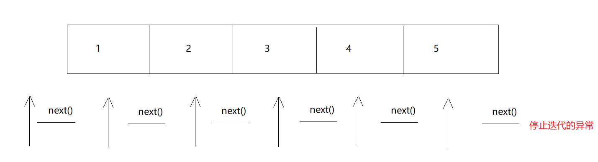

# 第三章.生成器

```java
1.问题说明:
  直接我们定义一个容器,往里面添加了元素,那么这些元素就会一股脑进入到内存中,如果数据量过大,就会占内存,所以我们就想按需生成数据,这样就省内存了
      
  可以用生成器:用的时候生成数据给咱们用,不用不生成
      
2.生成器概述:生成器(generator),是一种按需生成数据的特殊迭代器,用yield实现返回,不会一次性把所有结果都放到内存中
           生成器也是可以使用for循环遍历的
3.特点:
  a.生成器中的每一个元素不是直接全部创建出来,而是 用一个 创建一个出来
    然后用yield将这个数据返回
  b.调用生成器中的next()方法,获取yield返回的值,然后暂停,等到下一次调用next()方法才会继续往下执行获取下一个yield返回的结果
      
4.yield的特点:
  a.将生成器生成的数据返回
  b.暂停执行
  c.需要等到再次调用next方法,才会从暂停的位置继续执行
```

## 1.使用元组推导式获取生成器

```python
gen = (x for x in range(1,10))
# print(tuple1)
for element in gen:
    print(element)
```

## 2.通过自定义函数来获取一个生成器

```python
def get_gen():
    print("哈哈哈哈哈哈")
    for i in range(1,6):
        yield i

gen = get_gen()
print(next(gen))
print(next(gen))
print(next(gen))
print(next(gen))
print(next(gen))
```

```python
gen = get_gen()
        ↓
   [生成器创建，未执行get_gen()方法]
next(gen) → i=1 → yield 1 → 暂停 → 输出 1
next(gen) → i=2 → yield 2 → 暂停 → 输出 2
next(gen) → i=3 → yield 3 → 暂停 → 输出 3
next(gen) → i=4 → yield 4 → 暂停 → 输出 4
next(gen) → i=5 → yield 5 → 暂停 → 输出 5
next(gen) → 循环结束 → StopIteration
```

## 2.获取生成器函数中的return的值

```python
1.问题描述:
  我们通过不断的调用next方法去获取生成器中的yield返回的值,当生成器中的数据获取完毕,再获取会出现异常StopIteration,那么下面的代码就不会执行了
  如果后面有return 结果,我们也就获取不到了
```

```python
def get_gen():
    print("哈哈哈哈哈哈")
    for i in range(1,6):
        yield i

    return "生成器执行完毕了"

gen = get_gen()
print(next(gen))
print(next(gen))
print(next(gen))
print(next(gen))
print(next(gen))
print(next(gen))#StopIteration: 生成器执行完毕了
```

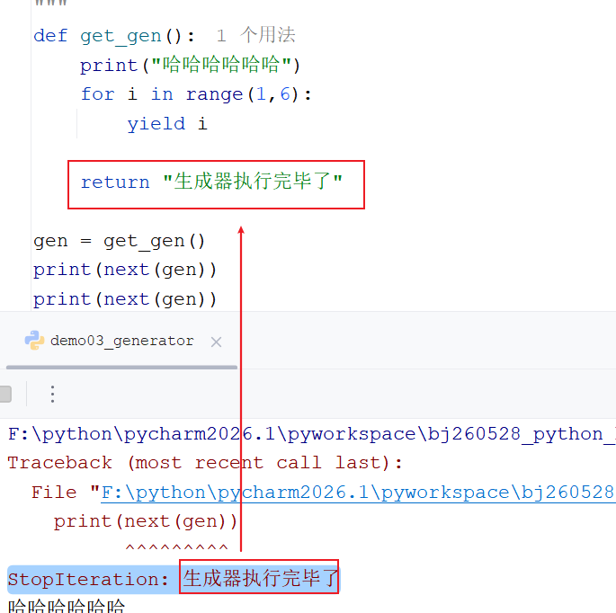

```python
获取return的值:
===================================================
def get_gen():
    print("哈哈哈哈哈哈")
    for i in range(1,6):
        yield i

    return "生成器执行完毕了"

gen = get_gen()

while True:
   try:
       print(next(gen))
   except StopIteration as e:
       # 拿到异常的描述
       print(e.value)
       break
```

## 3.send函数

```python
1.问题:
  刚开始我们都是用next方法去触发生成器,并从生成器中获取数据,那么还有一个方法也可以触发生成器,这个方法就是send方法

2.send和next方法的区别:
  a.相同点:两个都可以触发生成器
  b.不同点:
    next()只从生成器中获取数据
    send()是从生成器中获取数据的同时,往生成器中再传一个数据过去

3.send方法的作用:
  Python 生成器的 send() 用来在 yield 暂停处往生成器里“送一个值”，并同时取到下一个 yield 产出的值
```

```python
def get_gen():
    print("生成器开始执行了")
    for i in range(1,6):
        msg = yield i
        print(f"接收到消息：{msg}")

    return "生成器执行完毕了"

gen = get_gen()
print("第1次获取的值:",next(gen))
print("第2次获取的值:",gen.send("第一次发送值"))
print("第3次获取的值:",gen.send("第二次发送值"))
print("第4次获取的值:",gen.send("第三次发送值"))
print("第5次获取的值:",gen.send("第四次发送值"))
print("===================================")
try:
    print("第6次获取的值:",gen.send("第五次发送值"))
except StopIteration as e:
    print(e.value)
```

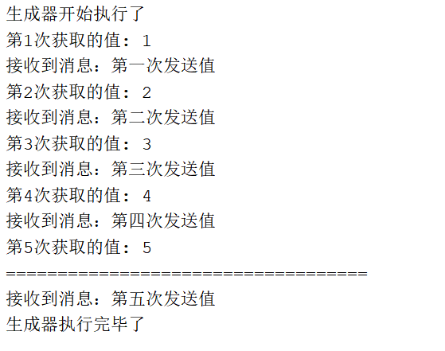

```java
执行流程:
=====================================================
gen = get_gen()
   ↓
next(gen)
   → 打印“生成器开始执行”
   → yield 1
   → 返回 1
gen.send("第一次发送")
   → msg = "第一次发送"
   → 打印“收到 send：第一次发送”
   → yield 2
   → 返回 2
gen.send("第二次发送")
   → msg = "第二次发送"
   → 打印“收到 send：第二次发送”
   → yield 3
   → 返回 3
...
最后 send 后循环结束
   → return "生成器执行完毕"
   → StopIteration.value 拿到 return 值
```

### 3.1.使用send函数启动生成器

```java
send(None)
```

```python
def get_gen():
    print("生成器开始执行了")
    for i in range(1,6):
        msg = yield i
        print(f"接收到消息：{msg}")

    return "生成器执行完毕了"

gen = get_gen()
print("第1次获取的值:",gen.send(None))
print("第2次获取的值:",gen.send("第一次发送值"))
print("第3次获取的值:",gen.send("第二次发送值"))
print("第4次获取的值:",gen.send("第三次发送值"))
print("第5次获取的值:",gen.send("第四次发送值"))
print("===================================")
try:
    print("第6次获取的值:",gen.send("第五次发送值"))
except StopIteration as e:
    print(e.value)
```

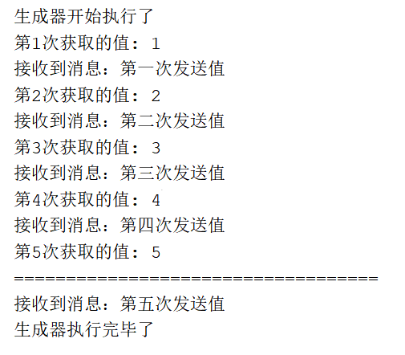

# 第四章.命名空间和作用域(选讲)

## 1. 命名空间介绍

```python
1.概述:是一种用来管理变量名和对应对象映射关系的代名词
      命名空间（namespace） 就是 Python 存放名字和对象对应关系的地方。可以把它理解成：名字 → 对象的“字典”。
      说白了:命名空间 = 名字在哪里有效、名字指向哪个对象。
            a = 10 ->意思是：在当前命名空间里，名字 `a` 绑定到对象 `10`。
2.举例:
  比如每一个房间,有卧室,客厅,厨房等(命名空间)里面有自己的储物柜(变量名/函数名/类名),那么即使两个储物柜名字一样(比如都叫做a),也不会互相干扰(比如客厅的a放钥匙,卧室的a放手机)
3.作用:
  可以区分重名的成员,给重名的成员加上一个命名空间,可以避免名字冲突,明确名字的查找规则
```

## 2. 为什么需要命名空间

避免名字冲突：

```python
def func():
  x = 1
x = 100
```

```java
全局里有一个 x
func() 里有一个 x
它们互不影响
就是因为它们处在不同命名空间。
```

## 3. Python 的命名空间类型

| 类型             | 说明              | 例子                   |
| :--------------- | :---------------- | :--------------------- |
| 内置命名空间     | Python 自带的名字 | `print`, `len`, `int`  |
| 全局命名空间     | 模块级变量        | 文件顶层定义的变量     |
| 局部命名空间     | 函数内部变量      | 函数里的临时变量       |
| 嵌套局部命名空间 | 外层函数变量      | 嵌套函数中的 enclosing |

```python
x = "全局x"

def outer():

   x = "外层x"

   def inner():
       
       x = "内层x"

       print(x)   # 内层x

   inner()

outer()

print(x)   # 全局x
```

```java
说明：
inner() 里的 x → 局部命名空间
outer() 里的 x → 外层命名空间
文件顶层的 x → 全局命名空间
```

## 4. 内置命名空间

```java
print("hello")

len([1, 2, 3])

print、len 来自 built-in 命名空间，不用定义就能用。
```

## 5. 全局命名空间

```python
name = "张三"

age = 18

def show():

  print(name)
```

```java
name、age 属于当前模块的全局命名空间。
```

## 6. 局部命名空间

```python
def func():

    a = 10

    b = 20

    print(a + b)

func()
# print(a)   # ❌ 报错，a 不在全局命名空间
```

```java
a、b 只在 func() 的局部命名空间里有效
```

## 7.作用域

### 7.1.介绍

```python
1.概述:指的是一种区域中成员的作用范围
2.python中的作用域:
  在python中有四种作用域,分别用四个不同的关键字来表示不同的作用域:
      Local:最内层作用域,表示局部的成员
      Enclosing:非局部,非全局的作用域(中间的),嵌套作用域
      Global:倒数第二层作用域,包含当前模块的全局名称
      Built-in:最外层作用域,是内置名称的命名空间
3.LEGB查找规则:Python 找变量时，按这个顺序
  L → Local      局部
  E → Enclosing  嵌套外层
  G → Global     全局
  B → Built-in   内置

 找到就用，找不到就报 `NameError`。
    
4.作用域中最常用的两个关键字:
  global:代表全局作用域中的成员
  nonlocal:代表的是嵌套作用域中的成员    
```

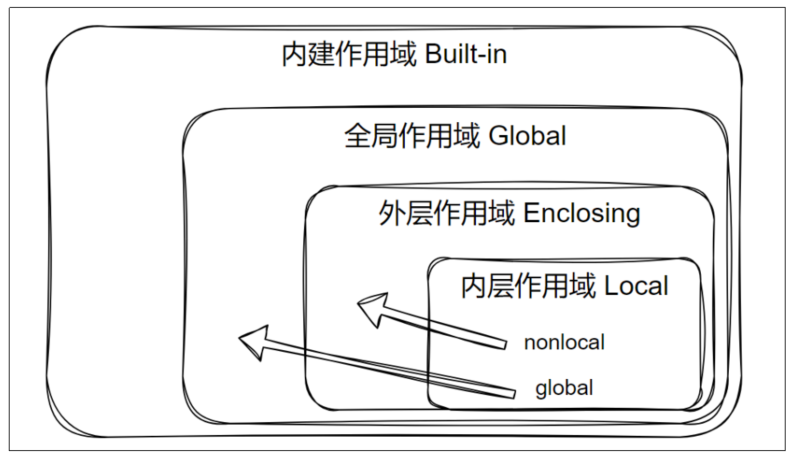


### 7.2.global和nonlocal的使用

```java
1.global:代表全局作用域中的成员
2.nonlocal:代表的是嵌套作用域中的成员  
```

```python
count = 0
def add():
    global count
    count += 1
    print(count)
add()
```

```python
def outer():
    x = 10 #这就是嵌套作用域中的 x
    def inner():
        nonlocal x
        x = 20
    inner()
    print(x)   # 20

outer()
```

# 第五章.闭包

## 1.闭包的介绍

```python
1.问题:
  当函数调用完毕之后,函数就会在内存中消失,函数中的变量也会被销毁;那么我们有的时候希望在函数执行完毕之后,那么函数中的数据还能继续使用,怎么办呢? -> 用到了闭包

2.概述:其实闭包就是让函数中的变量能重复使用的一种手段

3.构建闭包的条件:
  a.外部函数内定义一个内部函数
  b.内部函数访问外部函数的变量
  c.外部函数将内部函数作为返回值返回->让外层函数中的变量活下来的关键步骤

4.作用:延长外部函数中变量的生命周期
```

## 2.闭包的使用

```python
def outer():
    num = 10
    def inner():
        print(num)
    return inner

inner = outer()
inner()
inner()
inner()
```

## 3.闭包的说明

```py
def outer():
    num = 10
    def inner():
        nonlocal num
        num+=1
        print(num)
    return inner

inner = outer()
inner()#11
inner()#12  -> 记住了上一次的值,按常理来说调用第一次调用outer之后里面的num就消失了,应该重头开始记
inner()#13
```

```python
1.说明:
  当我们调用完outer()之后,outer()里面的num就消失了,但是我们调用inner的时候还能操作num,这是为啥呢?
2.解释:在生成num的时候,其实内存会为num生成一个容器,然后将num放到这个容器中,这时我们再操作就是操作这个容器中的num了
3.验证:
  a.__closure__:可以查看是否是闭包函数,如果是,返回一个元组;如果是一个普通函数,返回就是none
```

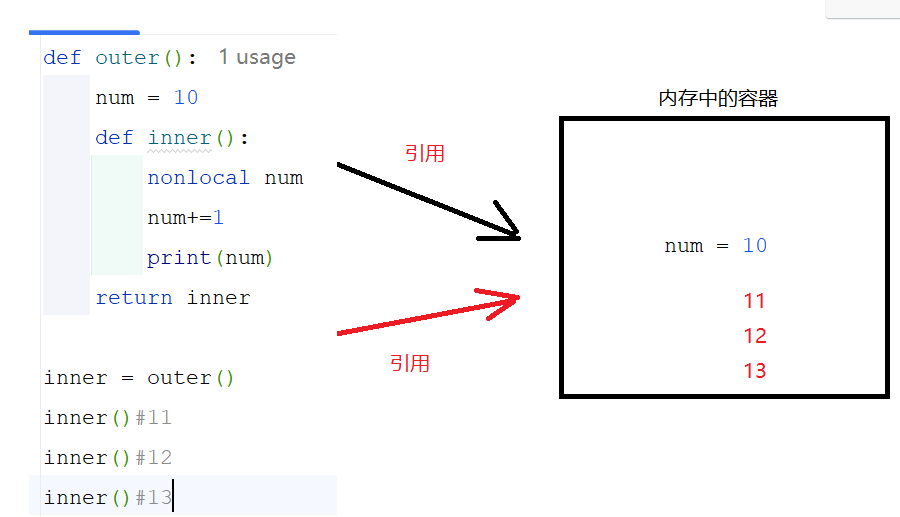

```py
def outer():
    num = 10
    # 获取num的地址值,将其变成十六进制 0x7ff9950aead8
    print(hex(id(num)))
    def inner():
        nonlocal num
        num+=1
        print(num)
    return inner

inner = outer()

# (<cell at 0x0000022C131A4DC0: int object at 0x00007FF9950AEAD8>,)元组
print(inner.__closure__)
```

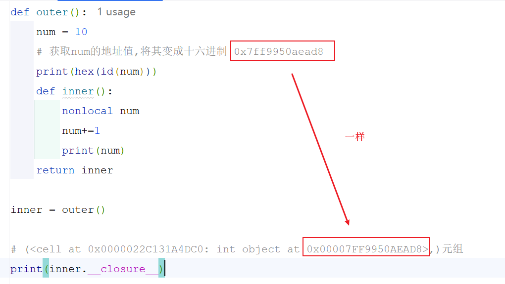

> 注意:
>
>   1.在闭包中使用的变量会放到元组中,如果没有被内层函数使用的变量,就不会在元组中
>
>   2.调用多次外层函数,会得到多个不同的闭包,多个闭包之间的数据互不影响
>
> ```py
> def outer():
>     num = 10
>     def inner():
>         nonlocal num
>         num+=1
>         print(num)
>     return inner
> 
> inner = outer()
> inner()#11
> inner()#12
> inner()#13
> print("=======================")
> inner2 = outer()
> inner2()#11
> inner2()#12
> inner2()#13
> ```

## 4.使用场景

```py
如果想定义一个固定的"定制版函数",就可以使用闭包函数
```

```python
举例:
  调用方法,传递一个参数,让这个参数内容的前面和后面加指定的字符,比如: ***尚硅谷***
```

```python
def concat(char,n):
    def show_concat(str1):
        print(char*n+str1+char*n)

    return show_concat

concat1 = concat("*",3)
concat1("尚硅谷")
concat1("Python")

```

> 缺点:
>
> 1. 对初学者理解起来不太友好,滥用闭包的话可读性会比较差
>
> 2. 如果闭包中引用了很大的对象,又长期不释放,会占用内存
>
> 3. 很多场景下,其实用[类+实例属性]会更清晰,不一定非得用闭包
>
> ```python
> class Concat:
>     def __init__(self,str1,n):
>         self.str1 = str1
>         self.n = n
> 
>     def show(self,msg):
>         print(self.str1*self.n+msg+self.str1*self.n)
> 
> 
> c1 = Concat("*",3)
> c1.show("尚硅谷")
> 
> ```

