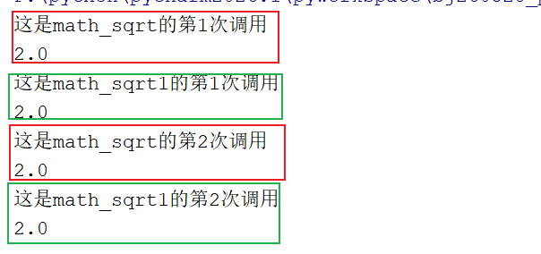
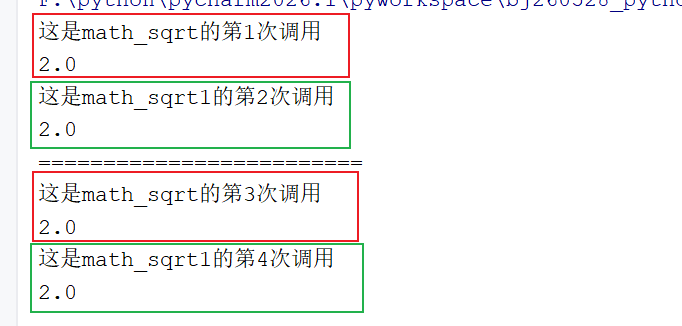
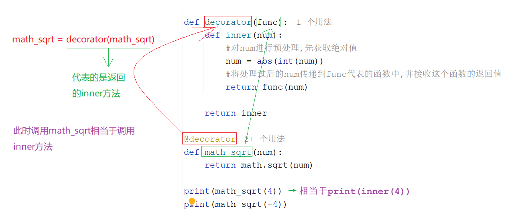
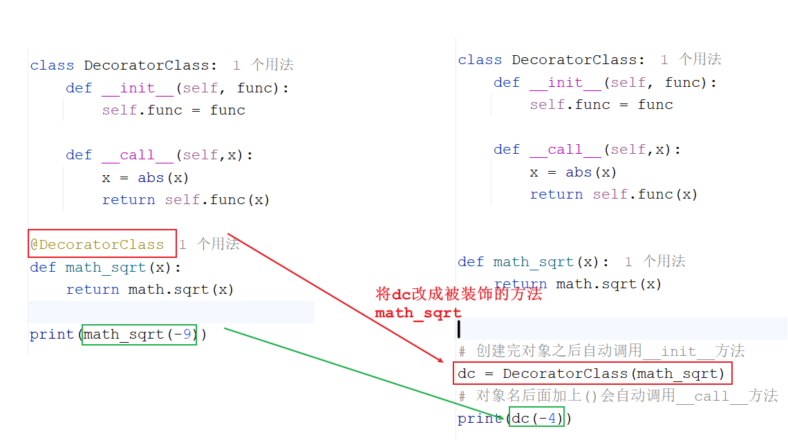
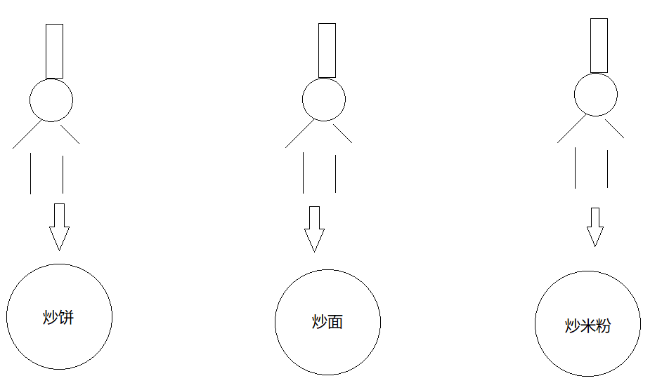
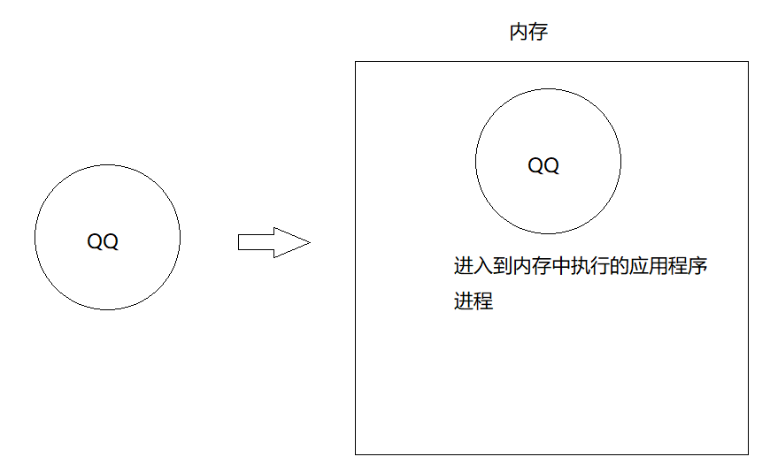

# day11_装饰器&多线程

```java
课前回顾:
  1.迭代器:遍历容器
    a.获取: iter(容器名)
    b.方法: next()获取下一个元素    
  2.生成器:generator
    a.主打的是:用的时候创建返回,不用不创建,省内存
    b.生成数据之后如何返回:
      yield 数据   -> 将数据返回,同时暂停
    c.send方法:获取生成器生成的数据的同时向生成器发送一个数据
    d.获取return的结果:捕获异常,调用异常对象的value
    e.send方法启动生成器
  3.闭包:其实是一种代码的设计
    函数嵌套,外层函数返回内层函数   -> 延长外层函数中数据的生命周期
    闭包产生,内存中会产生一个容器,将数据放到这个容器中,我们操作都是直接操作这个容器中的数据
      
      
今日重点:
  1.会装饰器的基本使用
  2.会多进程的创建
    a.直接使用Process
    b.继承Process
    c.进程池
```

# 第一章.装饰器

## 1.装饰器的介绍和基本使用

```python
1.概述:装饰器可以简单理解为是一个函数,这个函数能接收另外一个函数作为参数,然后处理之后返回一个新的函数
2.作用:
  在不改变原函数代码的前提下,动态的增强或者修改这个函数的功能

3.语法:以下语法很明显就是一个闭包操作
  def decorator(function):
      def inner(参数):
          #写增强方法的代码
          return function(参数)
          #写增强方法的代码
      return inner      
```

```py
import math


def math_sqrt(num):
    return math.sqrt(num)

# print(math_sqrt(4))
# print(math_sqrt(-4))#如果传递负数,会报错

print("==============================")

"""
  定义一个装饰器,对math_sqrt进行增强
  将传递过来的值,先取一个绝对值,变成整数
"""

def decorator(func):
    def inner(num):
        #对num进行预处理,先获取绝对值
        num = abs(int(num))
        #将处理过后的num传递到func代表的函数中,并接收这个函数的返回值
        return func(num)

    return inner

"""
 1.调用decorator,执行要装饰的方法,这个decorator方法返回的是inner方法
 2.调用inner(4)方法,传递要开平方的数据,然后走到return func(4)
 3.return后面的func方法其实代表的就是当初调用decorator方法是传递的math_sqrt方法
 4.那么就会先走math_sqrt算出结果,并通过inner中的return将结果返回给调用处
 5.直接输出
"""
inner = decorator(math_sqrt)
print(inner(4))
print(inner(-4))
```

## 2.装饰器增强方式和普通方法区别

### 2.1.复用性说明

```java
1.装饰器方式我们只需要调用一次decorator,它就为我们留下了inner方法,而且还记住了被装饰的方法,以后我们想要求平方根,直接调用inner方法,只需要给inner传递值即可,不需要每次都要传递被装饰的方法,复用性强

2.普通方式虽然也能实现增强,但是执行完毕之后什么都没有留下,下次调用我们必须要指定增强的方法是谁,操作的值是谁
复用性不强  
```

```python
def math_sqrt(num):
    return math.sqrt(num)

# print(math_sqrt(4))
# print(math_sqrt(-4))#如果传递负数,会报错

print("==============================")

"""
  定义一个装饰器,对math_sqrt进行增强
  将传递过来的值,先取一个绝对值,变成整数
"""

def decorator(func):
    def inner(num):
        #对num进行预处理,先获取绝对值
        num = abs(int(num))
        #将处理过后的num传递到func代表的函数中,并接收这个函数的返回值
        return func(num)

    return inner


# 普通的方式增强
def decorator1(function,x):
    x = abs(x)
    return function(x)

"""
 1.调用decorator,执行要装饰的方法,这个decorator方法返回的是inner方法
 2.调用inner(4)方法,传递要开平方的数据,然后走到return func(4)
 3.return后面的func方法其实代表的就是当初调用decorator方法是传递的math_sqrt方法
 4.那么就会先走math_sqrt算出结果,并通过inner中的return将结果返回给调用处
 5.直接输出
"""
inner = decorator(math_sqrt)
print(inner(4))
print(inner(-4))

print("==============================")
print(decorator1(math_sqrt, 4))
print(decorator1(math_sqrt, -4))
```

### 2.2.记录状态说明

```java
1.如果想分别记录不同方法被调用了多少次,那么用装饰器方式可以清楚地记录
    
2.如果使用普通方法记录不同方法被调用了多少次,次数就会错乱    
```

```python
def math_sqrt(num):
    return math.sqrt(num)

def math_sqrt1(num):
    return math.sqrt(num)

def decorator(func):
    count = 0
    def inner(num):
        nonlocal count
        count+=1
        print(f"这是{func.__name__}的第{count}次调用")
        #对num进行预处理,先获取绝对值
        num = abs(int(num))
        #将处理过后的num传递到func代表的函数中,并接收这个函数的返回值
        return func(num)

    return inner

inner = decorator(math_sqrt)
inner1 = decorator(math_sqrt1)
print(inner(4))
print(inner1(-4))
print(inner(4))
print(inner1(-4))
```



```python
def math_sqrt(num):
    return math.sqrt(num)

def math_sqrt1(num):
    return math.sqrt(num)

count = 0#全局变量
# 普通的方式增强
def decorator1(function,x):
    global  count
    count+=1
    print(f"这是{function.__name__}的第{count}次调用")
    x = abs(x)
    return function(x)

print(decorator1(math_sqrt, 4))
print(decorator1(math_sqrt1, -4))
print("=========================")
print(decorator1(math_sqrt, 4))
print(decorator1(math_sqrt1, -4))
```



## 3.装饰器的语法糖

```python
1.注解:
  @装饰器方法名
2.编写位置:
  被装饰的方法上
3.作用:
  简化调用
```

```py
import math

def decorator(func):
    def inner(num):
        #对num进行预处理,先获取绝对值
        num = abs(int(num))
        #将处理过后的num传递到func代表的函数中,并接收这个函数的返回值
        return func(num)

    return inner

@decorator
def math_sqrt(num):
    return math.sqrt(num)

print(math_sqrt(4))
print(math_sqrt(-4))
```

> 第1步：定义 math_sqrt 函数
>
> 第2步：自动执行 decorator(math_sqrt)
>
> 第3步：decorator 返回 inner
>
> 第4步：math_sqrt = inner
>
> 

## 4.多层装饰器(多个装饰器)

```python
1.概述:说白了就是写多个装饰器共同作用一个函数
2.调用方式:
  想让哪个装饰器函数先执行,就先调用哪个装饰器函数
```

```python
def decorator_int(func):
    def inner(num):
        #对num进行预处理,先获取绝对值
        num = int(num)
        #将处理过后的num传递到func代表的函数中,并接收这个函数的返回值
        return func(num)

    return inner


def decorator_abs(func):
    def inner(num):
        #对num进行预处理,先获取绝对值
        num = abs(num)
        #将处理过后的num传递到func代表的函数中,并接收这个函数的返回值
        return func(num)

    return inner

@decorator_int
@decorator_abs
def math_sqrt(num):
    return math.sqrt(num)

print(math_sqrt("-4"))
```

## 5.带参数的装饰器

```python
1.需求:定义一个函数,实现两次开平方根
```

### 5.1.解决方式1:直接给装饰器内嵌函数加一个形参

```py
import math

def decorator(func):
    def inner(num,n):
        #对num进行预处理,先获取绝对值
        num = abs(int(num))
        for i in range(n):
            num = func(num)
        #将处理过后的num传递到func代表的函数中,并接收这个函数的返回值
        return num

    return inner

@decorator
def math_sqrt(num):
    return math.sqrt(num)
print(math_sqrt(16,2))
```

```java
1.我们使用装饰器的目的就是单纯的想在装饰阶段就决定规则,但是现在这个规则被我们放到了每次调用里面,每次调用还要再指定开几次平方根这种规则,这样写就不太像装饰器了
    
2.怎么办呢?
  看了一使用@time语法糖
```

### 5.2.解决方式2:利用语法糖的方式再套一层函数当做次数

```py
def times(n):
    def decorator_abs(func):
        def inner(num):
            # 对num进行预处理,先获取绝对值
            num = abs(int(num))
            for i in range(n):
                num = func(num)
            # 将处理过后的num传递到func代表的函数中,并接收这个函数的返回值
            return num

        return inner

    return decorator_abs


"""
 time方法最终返回的是一个装饰器
"""
@times(2)
def math_sqrt(num):
    return math.sqrt(num)


print(math_sqrt(16))
print(math_sqrt(256))
```

```java
@times(2)
def math_sqrt(...)
        ↓
times(2) 返回 decorator_abs
        ↓
decorator_abs(math_sqrt) 返回 inner
        ↓
math_sqrt = inner
print(math_sqrt(256))
        ↓
inner(256)
        ↓
abs(256) = 256
        ↓
func(256) = 16
        ↓
func(16) = 4
        ↓
返回 4
```

## 6.类装饰器

```python
1.概述:包含了__call__这个魔法方法的类,叫做类装饰器
2.调用时机:对象后面加括号 () 调用时，就会执行 __call__()
```

```python
class DecoratorClass:
    def __init__(self):
        print("__init__方法执行了")

    def __call__(self):
        print("__call__方法执行了")

#创建对象之后会自动调用__init__方法
dc = DecoratorClass()

#对象名后面加()会自动调用__call__方法
dc()

```

### 6.1.普通类装饰器实现

```python
class DecoratorClass:
    def __init__(self,func):
        self.func = func

    def __call__(self,x):
        x = abs(x)
        return self.func(x)

def math_sqrt(num):
    return math.sqrt(num)


dc = DecoratorClass(math_sqrt)
print(dc(4))

```

### 6.2.配合语法糖实现类装饰器

```py
import math


class DecoratorClass:
    def __init__(self,func):
        self.func = func

    def __call__(self,x):
        x = abs(x)
        return self.func(x)

@DecoratorClass
def math_sqrt(num):
    return math.sqrt(num)

print(math_sqrt(4))
```



# 第二章.多线程和多进程基本知识

## 1.并发和并行

```python
1.概述:并发和并行指的是多个任务的执行方式
```

```java
并行:在同一个时刻,有多个指令在多个CPU上(同时)执行(好比是多个人做不同的事儿)
    比如:多个厨师在炒多个菜
```



```java
并发:在同一个时刻,有多个指令在单个CPU上(交替)执行
    比如:一个厨师在炒多个菜
```


```java
细节:
  1.之前CPU是单核,但是在执行多个程序的时候好像是在同时执行,原因是CPU在多个线程之间做高速切换
  2.现在咱们的CPU都是多核多线程的了,比如2核4线程,那么CPU可以同时运行4个线程,此时不用切换,但是如果多了,CPU就要切换了,所以现在CPU在执行程序的时候并发和并行都存在
```

## 2.同步和异步

```python
多个任务之间的依赖关系
```

```python
1.同步:多个任务中,一个任务执行,其他任务不能执行,需要排队
2.异步:多个任务可以同时执行,多个任务之间不互相影响
```

# 第三章.多进程

```java
1.进程的概述:进入到内存中执行的应用程序,一个程序运行起来就会有一个主进程
```



## 1.创建进程的方式1_multiprocessing.Process

> 不同的操作系统创建进程的方式是不一样的
>
> Unix/Linux操作系统提供了一个 **os.fork()** 系统调用，它非常特殊。普通的函数调用，调用一次，返回一次，但是 **fork()** 调用一次，返回两次，因为操作系统自动把当前进程（父进程）复制了一份（子进程），然后，分别在父进程和子进程内返回
>
> Windows 中没有 **fork()** 调用，不过Python提供了一个跨平台的多进程模块 **multiprocessing**。**multiprocessing** 模块提供了一个 **Process** 类来代表一个进程对象。

```python
1.导入进程工具包
  import mutiprocessing
2.通过进程类创建进程对象
  进程对象 = mutiprocessing.Process(参数1,参数2...)
3.启动进程执行任务
  进程对象.start() -> 调用start底层会调用run方法(写的是执行的进程任务),然后再调用target调用的函数
```

```python
进程对象 = multiprocessing.Process(group=None, target=None, name=None, args=(), kwargs={}, *, daemon=None)

1.group=None:指明当前进程属于哪个组,可以通过分组来管理多个进程,一般不用传递 
2.target=函数名:指的是调用的是哪个函数
  启动进程调用start方法,start方法底层会自动调用run方法,在run方法中会调用target配置的函数
    
3.name=进程名字:给当前进程取的名字
4.arges=(参数1,参数2...):以元组的形式给target调用的函数传递参数,用元组形式给target调用的函数传递参数,参数顺序必须一致
5.kwargs={}:以字典的形式给target调用的函数传递参数,用字典形式给target调用的函数传递参数,参数顺序可以不一致
```

```python
import multiprocessing


def coding():
    for i in range(10):
        print(f"敲代码{i}...")

def music():
    for i in range(10):
        print(f"听音乐{i}......")


if __name__ == '__main__':

    #创建进程对象
    p1 = multiprocessing.Process(target=coding)
    p2 = multiprocessing.Process(target=music)

    #开启进程
    p1.start()
    p2.start()

```

> ```java
> 1.问题:如果不加if __name__ == '__main__'会报错
> 2.原因:
>   如果不加if __name__ == '__main__'判断,那么当执行p1.start方法的时候会创建子进程,子进程会重新导入当前的python文件或者叫做python模块,一导入,默认会执行当前模块中的所有代码(在导入模块的时候讲过),然后就又执行到p1.start(),然后再创建子进程,子进程再重新导入当前python文件或者python模块,然后再执行当前模块中所有的代码,再执行p1.start,这样就会造成无限创建子进程的情况
>       
>   所以加上if __name__ == '__main__'判断,加上之后当第一次执行p1.start或者p2.start的时候,创建子进程,重新导入当前模块,之后就不会再执行if __name__ == '__main__'里面的代码了,因为子进程的名字不叫__main__
> ```

### 1.1.Process参数解释

```python
1.group=None:指明当前进程属于哪个组,可以通过分组来管理多个进程 
2.target=函数名:指的是调用的是哪个函数
3.name=进程名字:给当前进程取的名字
4.arges=(参数1,参数2...):以元组的形式给target调用的函数传递参数,用元组形式给target调用的函数传递参数,参数顺序必须一致
5.kwargs={}:以字典的形式给target调用的函数传递参数,用字典形式给target调用的函数传递参数,参数顺序可以不一致
```

```py
def coding(name,count):
    for i in range(count):
        print(f"{name}正在敲代码{i}...")

def music(name,count):
    for i in range(count):
        print(f"{name}正在听音乐{i}......")


if __name__ == '__main__':

    #创建进程对象
    p1 = multiprocessing.Process(target=coding,args=("金莲",10))
    p2 = multiprocessing.Process(target=music,kwargs={"name":"涛哥","count":10})

    #开启进程
    p1.start()
    p2.start()
```

## 2.创建进程的方式2_继承Process

```python
继承Process,重写run函数,设置线程任务
```

```python
import time
from multiprocessing import Process


class Coding(Process):
    def run(self):
        for i in range(10):
            print(f"{self.name}正在敲代码{i}...")
            #让进程睡眠,参数传递秒
            # time.sleep(1)


class Sleep(Process):
    def run(self):
        for i in range(10):
            print(f"{self.name}正在睡大觉{i}......")
            # time.sleep(1)


if __name__ == '__main__':
    p1 = Coding(name="金莲")
    p2 = Sleep(name="涛哥")
    p1.start()
    p2.start()
```

## 3.创建进程的方式3_进程池

```java
1.概述:进程池（Process Pool） 就是：提前创建好几个子进程，任务来了直接分配给空闲进程执行，用完再把进程留着复用，而不是每来一个任务就 创建一次进程对象
2.为什么需要进程池:
  之前的写法会频繁创建进程,任务执行完毕就会频繁销毁进程,开销大,管理起来也很麻烦,如果用进程池,提前创建指定数量的进程对象,然后来了任务自动分配
      
3.使用到的对象和方法
  a.multiprocessing.Pool(进程对象数量) -> 创建进程池对象,指定进程对象数量
      
  b.apply(要执行的方法名)  同步执行
    apply_async(要执行的方法名)  异步执行        
```

```python
import multiprocessing
import time


def coding():
    for i in range(10):
        print(f"敲代码{i}...")

def music():
    for i in range(10):
        print(f"听音乐{i}......")


if __name__ == '__main__':
    # 创建进程池对象,指定有多少个进程对象
    pool = multiprocessing.Pool(5)
    # pool.apply(coding)
    # pool.apply(music)

    """
      1.如果调用apply_async方法证明是异步调用
        异步操作的特点就是多个进程谁也不等谁,同时执行
        当两个进程任务放到进程池中找进程对象执行的过程中
        主进程会快速执行到代码最后,当主进程执行完毕,程序结束了
        那么那两个进程任务没来得及执行,所有控制台没有输出内容
    """
    pool.apply_async(coding)
    pool.apply_async(music)

    """
      1.join的含义:让主进程等待,等待其他进程执行完毕之后,主进程再结束
      2.但是直接使用join会有问题:ValueError: Pool is still running
      3.问题的原因:
        join有等待的效果,等待所有代码执行完毕主进程再结束 
        但是进程池有一个特点,如果不close,进程池会一直等待新的进程任务
        
        所以就造成了一个局面:
          进程池再等待新的进程任务
          join再等待所有进程都执行完毕
          此时双方等死了,所以报错
          
      4.解决方案:
        在join前关闭进程池,不然进程池等待新的进程任务了    
    """

    pool.close()

    pool.join()

    # time.sleep(5)

```

## 4.获取进程编号_扩展

```python
1.概述:进程编号是进程的唯一标识,当进程关闭的时候,进程编号也会被同时释放
2.作用:
  a.根据锁定的唯一进程,方便我们管理和维护进程
  b.可以梳理子父进程的关系
3.方法:    
  a.os.getpid() 获取当前进程编号
  b.os.getppid() 获取父进程编号
```

```py
def coding():
    for i in range(10):
        print(f"敲代码{i}...")
        #获取当前进程的编号
        print(f"进程编号:{os.getpid()}...")
        #获取父进程的编号
        print(f"父进程编号:{os.getppid()}......")

def music():
    for i in range(10):
        print(f"听音乐{i}......")
        print(f"进程编号:{os.getpid()}...")
        #获取父进程的编号
        print(f"父进程编号:{os.getppid()}......")


if __name__ == '__main__':
    # 创建进程池对象,指定有多少个进程对象
    pool = multiprocessing.Pool(5)
    # pool.apply(coding)
    # pool.apply(music)

    """
      1.如果调用apply_async方法证明是异步调用
        异步操作的特点就是多个进程谁也不等谁,同时执行
        当两个进程任务放到进程池中找进程对象执行的过程中
        主进程会快速执行到代码最后,当主进程执行完毕,程序结束了
        那么那两个进程任务没来得及执行,所有控制台没有输出内容
    """
    pool.apply_async(coding)
    pool.apply_async(music)

    """
      1.join的含义:让主进程等待,等待其他进程执行完毕之后,主进程再结束
      2.但是直接使用join会有问题:ValueError: Pool is still running
      3.问题的原因:
        join有等待的效果,等待所有代码执行完毕主进程再结束 
        但是进程池有一个特点,如果不close,进程池会一直等待新的进程任务
        
        所以就造成了一个局面:
          进程池再等待新的进程任务
          join再等待所有进程都执行完毕
          此时双方等死了,所以报错
          
      4.解决方案:
        在join前关闭进程池,不然进程池等待新的进程任务了    
    """

    pool.close()

    print(f"主进程的编号为:{os.getpid()}..........")

    pool.join()

    # time.sleep(5)
```

## 5.多进程注意事项

```python
1.多进程之间不共享全局变量,数据互相隔离
2.原因:
  每个进程执行都会重新导入当前模块,所以每个进程都会有自己的一个独立内存
```

```python
定义一个列表,一个进程添加数据,另外一个进程查看数据,看看是否能查到添加的数据
```

```python
# 定义一个进程来添加元素
def add_list(list1):
    for i in range(5):
        list1.append(i)

    print(list1)


# 定义一个进程来直接查看列表
def show_list(list1):
    # 为了防止还没有添加元素就开始执行查看元素进程，所以让查看元素进程睡2秒
    time.sleep(2)
    print(list1)

# 定义main函数启动进程
if __name__ == '__main__':
    # 定义一个列表
    list1 = []
    p1 = Process(target = add_list,args = (list1,))
    p2 = Process(target = show_list,args = (list1,))
    p1.start()
    p2.start()
```


## 6.多进程之间实现数据共享

```java
1.问题描述:
  上面咱们说过,进程之间的数据是隔离的,那么将来我们有的需求需要让一个数据在多个进程之间共享操作,怎么办呢?
2.解决:使用Queue队列  

3.Queue队列的使用:
  a.获取Queue队列:multiprocessing.Manager().Queue()
  b.存取数据函数:
    put(数据):往队列中保存数据
    get():从队列中获取数据 
4.注意:
  a.队列对象一旦调用了get方法,那么对象中的数据也就没有了,第二次get是拿不到数据的
  b.使用队列的时候主进程不能提前结束,所以可以用join()函数,join函数只阻塞主进程
```

```python
import multiprocessing
import time


# 定义一个方法添加元素
def add_list(queue):
    list1 = queue.get()
    for i in range(5):
        list1.append(i)
        
    queue.put(list1)

    print(list1)


# 定义一个方法去看列表中的元素
def show_list(queue):
    time.sleep(3)
    list1 = queue.get()
    print(list1,".......")


if __name__ == '__main__':
   list1 = []
   manager = multiprocessing.Manager()
   queue = manager.Queue()
   #将list列表 放到 队列中
   queue.put(list1)

   #创建两个进程对象
   p1 = multiprocessing.Process(target=add_list,args=(queue,))
   p2 = multiprocessing.Process(target=show_list,args=(queue,))
   p1.start()
   p2.start()

   # 主进程在这里等待 p1 执行完
   p1.join()
   # 主进程在这里等待 p2 执行完
   p2.join()
```

