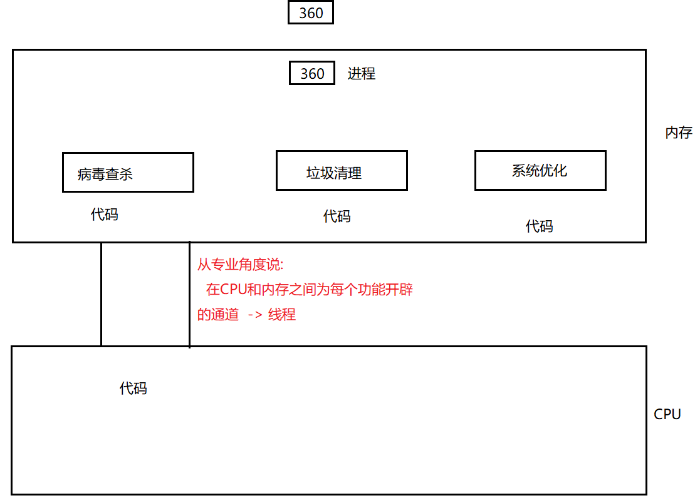
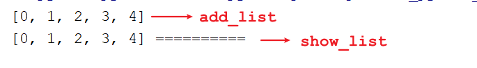
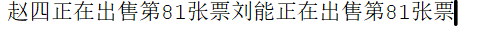

# day12_线程&正则表达式

```java
课前回顾:
  1.装饰器:代码的一种设计  -> 基本是闭包
   a.作用:对某个功能进行增强
  2.带参数的装饰器:@time(次数)  -> 套在装饰器外面的,返回的是装饰器
  3.语法糖:
    在被装饰的方法上面用一个注解  -> @装饰器名称
  4.类装饰器:  __init__方法和__call__方法
  5.实现多进程的方式1:
    multiprocessing.Process(target=方法名,name=给进程取名字,args=())
  6.实现多进程的方式2:
    继承Process
  7.进程池方式实现多进程:
    multiprocessing.Pool(进程对象数量)
    apply()  -> 执行进程任务  -> 同步
    apply_async -> 执行进程任务 -> 异步
    join() 等待其他执行完毕,主进程再执行
    close() 关闭进程池
  8.进程之间不能共享全局变量:
    想共享:Queue队列
    a.获取:multiprocessing.Manager().Queue()
    b.put():往队列中存储数据
    c.get():获取队列中的数据
        
        
今日重点:
 1.会实现多线程程序
 2.会解决线程不安全问题
   上锁
 3.能看懂正则即可
```

# 第一章.多线程

```java
1.线程:进程中的一个执行单元
2.线程作用:负责当前进程中程序的运行.一个进程中至少有一个线程(这个我们通常叫做主线程),一个进程还可以有多个线程,这样的应用程序就称之为多线程程序   
3.简单理解:
  进程中的一个功能就需要一条线程去执行
```



## 1.创建多线程方式1_直接利用threading对象

```python
1.导入模块:
  import threading
2.通过线程类创建线程对象:
  线程对象 = threading.Thread(target=要执行的方法名,name=线程名,args=(为方法赋值))
  
  注意:除了target参数之外,其他的参数写不写视情况而定
3.启动线程对象:
  线程对象.start()
```

```python
def music(name):
    for i in range(10):
        print(f"{name}正在听第{i}首歌......")
        time.sleep(0.1)


def movie(name):
    for i in range(10):
        print(f"{name}正在看第{i}部电影......")
        time.sleep(0.1)


if __name__ == '__main__':
    t1 = threading.Thread(target=music, args=("广坤",))
    t2 = threading.Thread(target=movie, args=("赵四",))
    # 启动线程
    t1.start()
    t2.start()
```

## 2.创建多线程方式2_通过继承Thread创建多线程

```python
1.定义一个子类,继承threading.Thread
2.重写run函数,设置线程任务
3.调用start开启线程,自动执行run函数
```

```python
class Music(threading.Thread):
    """
    继承 Python 内置 / 标准库类（如threading.Thread）时，
    必须调用父类__init__，否则功能失效；
    """
    def __init__(self, name):
        super().__init__()
        self.name = name

    def run(self):
        for i in range(10):
            print(f"{self.name}正在听第{i}首歌......")
            time.sleep(0.1)


class Movie(threading.Thread):
    """
    继承 Python 内置 / 标准库类（如threading.Thread）时，
    必须调用父类__init__，否则功能失效；
    """
    def __init__(self, name):
        super().__init__()
        self.name = name

    def run(self):
        for i in range(10):
            print(f"{self.name}正在看第{i}部电影......")
            time.sleep(0.1)


if __name__ == '__main__':
    t1 = Music("广坤")
    t2 = Movie("赵四")
    # 启动线程
    t1.start()
    t2.start()
```

## 3.创建多线程方式3_通过线程池创建线程

```python
1.获取线程池对象:
  concurrent.futures.ThreadPoolExecutor(max_workers=None, thread_name_prefix="", initializer=None, initargs=())

  a.max_workers:指定线程池最多能同时运行的线程数量（工作线程数上限） -> 最重要
  b.thread_name_prefix:辅助参数->线程池创建的线程会自动生成名称，比如默认是 ThreadPoolExecutor-0_0、                                    ThreadPoolExecutor-0_1 等；
                       如果设置了 thread_name_prefix="music-"，线程名称会变成 music-0、music-1 等，在多线程调试                        时能快速识别线程归属
  c.initializer=None:高级参数->指定一个初始化函数，线程池中的每个工作线程启动时都会执行这个函数
                     None 表示不执行任何初始化操作；
                     如果将None换成需要初始化的函数名,就代表每次工作线程启动都会先执行这个函数
                     适合需要给每个线程初始化资源的场景（比如每个线程初始化一个数据库连接、加载一个配置文件等）。
  d.initargs=():配合 initializer 使用,给 initializer 指定的初始化函数传递参数，是一个元组类型,要按照参数顺序传递

2.提交线程任务:
  submit(函数名,[元组或者字典])
  a.参数:
    函数名:将哪个函数设置的线程任务给线程池
    元组或者字典:给提交函数的参数赋值
  c.返回值:返回的是Future对象,可以调用其中的result()函数获取被提交执行函数的返回值
```

```py
import concurrent.futures

def music(name):
    return f"{name}正在听歌"

def movie(name):
    return f"{name}正在看电影"

if __name__ == '__main__':
    pool = concurrent.futures.ThreadPoolExecutor(3)
    future1 = pool.submit(music, "张三")
    future2 = pool.submit(movie, "赵四")
    print(future1.result())
    print(future2.result())

    #关闭线程池
    pool.shutdown()
    
    # with concurrent.futures.ThreadPoolExecutor(3) as pool:
    #     future1 = pool.submit(music, "张三")
    #     future2 = pool.submit(movie, "赵四")
    #     print(future1.result())
    #     print(future2.result())
```

## 4.守护线程_扩展

```python
需求:定义一个线程,循环100次输出 f"线程1执行了第{i}次...",然后在主线程中开启线程,但是要让主线程执行完毕之后,自己定义的线程也结束

解决方案:将自定义线程变成守护线程(当被守护的先线程死掉,守护线程也会死掉)
        线程对象.daemon = True
```

```py
def music(name):
    for i in range(100):
        print(f"{name}正在听第{i}首歌......")
        time.sleep(0.1)


if __name__ == '__main__':
    t1 = threading.Thread(target=music, args=("金莲",))

    #将t1设置为守护线程
    t1.daemon = True
    t1.start()

    #主线程循环10次
    for i in range(10):
        print(f"主线程正在听第{i}首歌......")
        time.sleep(0.1)

```

## 5.线程之间共享全局变量

```python
线程之间是可以共享全局变量的
```

```python
import threading
import time

list = []

def add_list():
    for i in range(5):
        list.append(i)
    print(list)

def show_list():
    time.sleep(3)
    print(list,"==========")

if __name__ == '__main__':
    t1 = threading.Thread(target=add_list)
    t2 = threading.Thread(target=show_list)
    t1.start()
    t2.start()
```



## 6.线程不安全问题

```python
问题的原因:多个线程共同访问同一个资源
```

```py
需求:有100张票,定义三个线程分别买票,每买一张就减一张
```

```py
import threading
import time

num = 100
def ticket():
    global num
    while True:
        time.sleep(0.1)
        if num>0:

            """
              threading.current_thread().name
              获取当前正在执行的线程名称
              哪个线程正在执行,就获取哪个线程的名称
            """
            print(f"{threading.current_thread().name}正在出售第{num}张票")
            num -= 1

if __name__ == '__main__':
    t1 = threading.Thread(target=ticket, name="广坤")
    t2 = threading.Thread(target=ticket, name="赵四")
    t3 = threading.Thread(target=ticket, name="刘能")
    t1.start()
    t2.start()
    t3.start()

```



## 7.解决线程不安全问题

```python
1.造成上述问题的原因:
  CPU在多个线程之间做高速切换
2.解决:上锁
3.互斥锁:对共享数据锁定,一个线程去执行,其他线程需要等待
3.互斥锁使用:
  a.获取锁对象:
    变量名 = threading.Lock()
  b.上锁:
    变量名.acquire()
  c.释放锁:
    变量名.release()  
```

```py
num = 100
#获取锁对象
lock = threading.Lock()
def ticket():
    global num
    while True:
        time.sleep(0.1)
        #上锁
        lock.acquire()
        if num>0:
            print(f"{threading.current_thread().name}正在出售第{num}张票")
            num -= 1
        #释放锁
        lock.release()

if __name__ == '__main__':
    t1 = threading.Thread(target=ticket, name="广坤")
    t2 = threading.Thread(target=ticket, name="赵四")
    t3 = threading.Thread(target=ticket, name="刘能")
    t1.start()
    t2.start()
    t3.start()
```

# 第二章.线程和进程的区别

```java
直接问AI即可
```

# 第三章.正则表达式

## 1.正则表达式的概念及演示

```java
1.概述:是一个具有特殊规则的字符串
2.作用:校验,查找,替换,提取
3.用到的函数:re模块中的函数
  re.match(正则,指定字符串) -> 判断指定的字符串是否符合正则表达式,如果匹配不上返回None
4.举例说明:
  验证一个qq号:  
    要求 不能以0开头 必须都是数字  必须是5-15位  
        [1-9][0-9]{4,14}
        
5.注意:
  match方法是匹配指定的字符串是否以指定的规定字符开头,所以需要在正则表达式前面加上^,最后加上$
  ^代表以什么什么开头
  $代表以什么什么结尾
```

```py
import re
data = input("请您输入一个QQ号:")
result01 = re.match("^[1-9][0-9]{4,14}$", data)
if result01!= None:
    print("您输入的QQ号格式正确")
else:
    print("您输入的QQ号格式不对")
```

## 2.正则表达式-字符类

```java
正则表达式-字符类:[]表示一个区间,范围可以自己定义
        语法示例：
        1. [abc]：代表a或者b，或者c字符中的一个。
        2. [^abc]：代表除a,b,c以外的任何字符。
        3. [a-z]：代表a-z的所有小写字符中的一个。
        4. [A-Z]：代表A-Z的所有大写字符中的一个。
        5. [0-9]：代表0-9之间的某一个数字字符。
        6. [a-zA-Z0-9]：代表a-z或者A-Z或者0-9之间的任意一个字符。
        7. [a-dm-p]：a 到 d 或 m 到 p之间的任意一个字符
```

```python
        #1.验证字符串是否以h开头,d结尾,中间是aeiou的某一个字符

        #2.验证字符串是否以h开头,d结尾,中间不是aeiou的某一个字符
       
        #3.验证字符串是否是开头a-z的任意一个小写字母,后面跟ad
```

```python
import re
# 1.验证字符串是否以h开头,d结尾,中间是aeiou的某一个字符
result01 = re.match("^[h][aeiou][d]$", "had")
# 2.验证字符串是否以h开头,d结尾,中间不是aeiou的某一个字符
result02 = re.match("^[h][^aeiou][d]$", "had")
# 3.验证字符串是否是开头a-z的任意一个小写字母,后面跟ad
result03 = re.match("^[a-z][a][d]$", "had")

if result03!=None:
    print("匹配成功")
else:
    print("匹配失败")
```

## 3.正则表达式-预定义字符

```java
 正则表达式-预定义字符
    语法示例：
    1. "." ： 匹配任何字符。(重点)  不能加[]
    2. "\d"：任何数字[0-9]的简写；(重点)
    3. "\D"：任何非数字[^0-9]的简写；
    4. "\s"： 空白字符：[ \t\n\x0B\f\r] 的简写
    5. "\S"： 非空白字符：[^\s] 的简写
    6. "\w"：单词字符：[a-zA-Z_0-9]的简写(重点)
    7. "\W"：非单词字符：[^\w]
     
 注意:如果使用预定义字符,需要在正则表达式前面写r,代表忽略\的转义字符含义    
```

```py
        #1.验证字符串是否是三位数字


        #2.验证手机号: 1开头 第二位3 5 8 剩下的都是0-9的数字


        #3.验证字符串是否以h开头,d结尾,中间是任意一个字符

```

```java
import re

# 1.验证字符串是否是三位数字
result01 = re.match(r"^\d\d\d$", "123")
# 2.验证手机号: 1开头 第二位3 5 8 剩下的都是0-9的数字
result02 = re.match(r"^[1][358]\d\d\d\d\d\d\d\d\d$", "13812345678")
# 3.验证字符串是否以h开头,d结尾,中间是任意一个字符
result03 = re.match("^[h].[d]$", "had")
if result03!=None:
    print("匹配成功")
else:
    print("匹配失败")
```

## 4. 正则表达式-数量词

```java
 正则表达式-数量词
        语法示例：x代表字符
        1. X? : x出现的数量为 0次或1次
        2. X* : x出现的数量为 0次到多次 任意次
        3. X+ : x出现的数量为 1次或多次 X>=1次
        4. X{n} : x出现的数量为 恰好n次 X=n次
        5. X{n,} : x出现的数量为 至少n次 X>=n次  x{3,}
        6. X{n,m}: x出现的数量为 n到m次(n和m都是包含的)   n=<X<=m
```

```py
        #1.验证字符串是否是三位数字


        #2.验证手机号: 1开头 第二位3 5 8 剩下的都是0-9的数字


        #3.验证qq号:  不能是0开头,都是数字,长度为5-15

```

```java
import re

# 1.验证字符串是否是三位数字
result01 = re.match(r"^\d{3}$", "122")
# 2.验证手机号: 1开头 第二位3 5 8 剩下的都是0-9的数字
result02 = re.match(r"^[1][358]\d{9}$", "13812345678")
# 3.验证qq号:  不能是0开头,都是数字,长度为5-15
result03 = re.match(r"^[1-9]\d{4,14}$", "0111111")
if result03!=None:
    print("匹配成功")
else:
    print("匹配失败")
```

## 5.正则表达式-分组括号( )

```java
正则表达式-分组括号( )  (abc)
```

```java
import re
result01 = re.match("^(abc)*$", "abcabcab")
if result01!=None:
    print("匹配成功")
else:
    print("匹配失败")
```

## 6.正则表达式生成网址:

```html
https://www.sojson.com/regex/generate
```

